# Chapter 2: Software Process

Software Engineering is a branch of systems engineering concerned with the
development of large and complex software intensive systems. It focuses on:

- the real-world goals for, services provided by, and constraints on such systems
- the precise specification and implementations
- the activities required in order to develop an assurance that the specifications and
real world-world goals have been met
- the evolution of these systems over time, and across systems families
- It is also concerned with the processes, methods and tools for the development of
software intensive systems in an economic and timely manner

## The Software Process

- A structured set of activities required to develop a software system
- Must involve: Specification, Design and implementation, Validation, Evolution

### Software Process Model

A software process model is an abstract representation of a process

Example: Integration and configuration

- The system is assembled from existing configurable components.
- May be plan-driven or agile.

In practice, most large systems are developed using a process that incorporates elements from all of these models.

#### Waterfall model:

- Plan-driven model
- Separate and distinct phases of specification and development

|  |
|:--:|
| A phase has to be completed before moving to the next phase |

- Drawbacks: difficulty of accommodating change after the process is executing
- Mostly used for large systems engineering projects (where a system is developed at several sites)
- Usually being deployed when the requirements are well-understood thus little changes will be made during the design proces - not realistic when most business systems have unstable requirements

#### Incremental development

- Specification, development and validation are interleaved.
- May be plan-driven or agile.

| 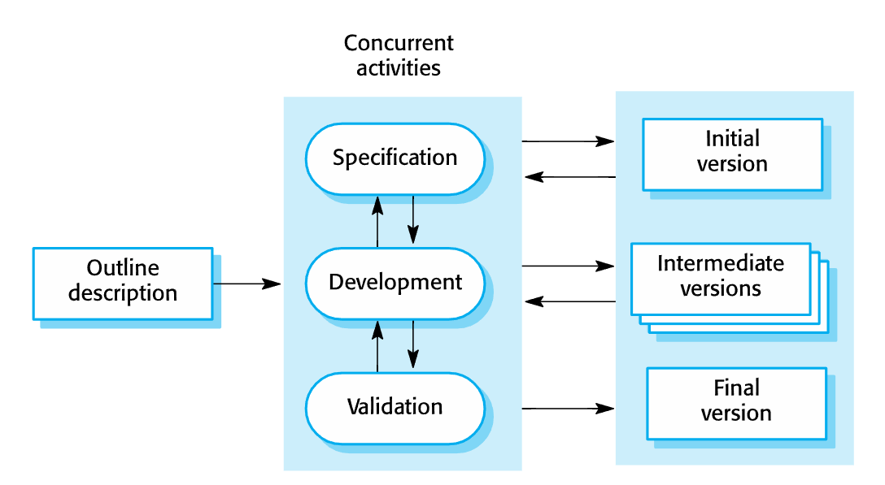 |
|:--:|
| Incremental development |

- Reduce the cost of accommodating changing customer requirements
- Easier to get customer feedback on the development work that has been done.
- More rapid delivery and deployment of useful software to the customer

Problems:

- Process is not visible (managers need regular delivers, not cost-effective to produce documents for every version)
- Degrading system structure as new things are added (need resource on refractoring to improve software, regular change can corrupt system)

#### Agile Development

|  |
|:--:|
| Agile Development |

| 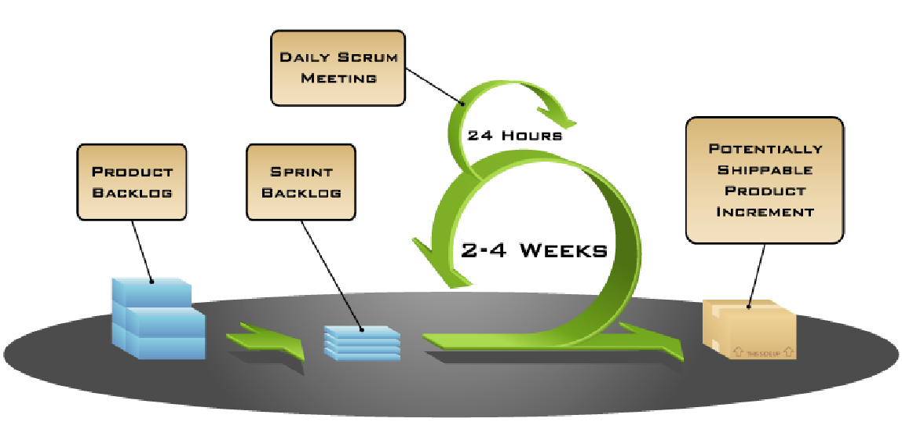 |
|:--:|
| Scrum |

- Benefits: More flexible; Product get to market faster; Better communication
- Drawbacks: Hard to predict; Final product is not released first; Documentation gets left behind

#### Reuse-oriented Software Engineering

- Based on software reuse where systems are integrated from existing components or application systems (COTS - Commercial-off-the-shelf) systems
- Reused elements may be configured to adapt their behaviour and functionality to a user’s requirements
- Reuse is now the standard approach for building many types of business system

|  |
|:--:|
| Reuse-oriented |

- Reduced costs and risks as less software is developed from scratch
- Faster delivery and deployment of system
- But requirements compromises are inevitable so system may not meet real needs of users
- Loss of control over evolution of reused system elements

## Process Activities

Real software processes are inter-leaved sequences of technical, collaborative and managerial activities with the overall goal of specifying, designing, implementing and testing a software system.
The four basic process activities (specified in your book) of specification, development, validation and evolution are organized differently in different development processes
In the waterfall model, they are organized in sequence, whereas in incremental development they are inter-leaved

### Software Specification

Establishing what services are required, constraints on the system’s operation and development
Requirements engineering process: Elicitation and analysis; Specification; Validation

|  |
|:--:|
| Requirements engineering process |

|  |
|:--:|
| General model of design process |

### System Implementation

- The software is implemented either by developing a program or programs or by configuring an application system
- Design and implementation are interleaved activities for most types of software system
- Programming is an individual activity with no standard process
- Debugging is the activity of finding program faults and correcting these faults

#### Software Validation

- Verification and validation (V & V): to show that a system conforms to its specification and meets the requirements of the system customer
- Involves checking and review processes and system testing (using testcases; most commonly used in V & V)

|  |
|:--:|
| Stages of Testing |

|  |
|:--:|
| Testing phases in a plan-driven software process |

#### Software Evolution

- Software is inherently flexible and can change (like requirements due to business circumstances)

| 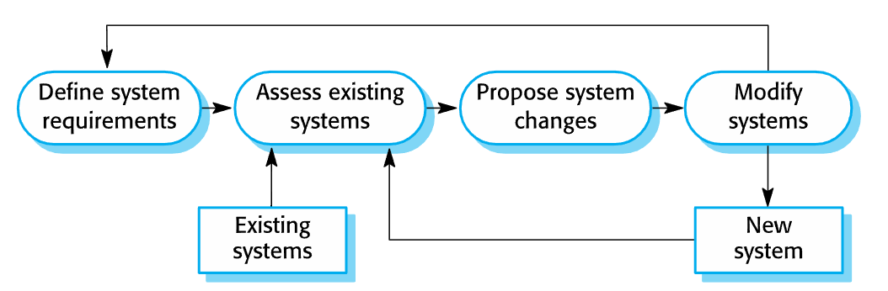 |
|:--:|
| Software Evolution |

### Coping with Change

#### Software Prototyping

- A prototype is an initial version of a system used to demonstrate concepts and try out design options
- Used in:
  - requirements engineering process: requirements elicitation and validation
  - design processes: options and develop UI design
  - testing process: run back-to-back test
- Benefits:
  - Improved system usability
  - A closer match to users’ real needs
  - Improved design quality
  - Improved maintainability
  - Reduced development effort

| 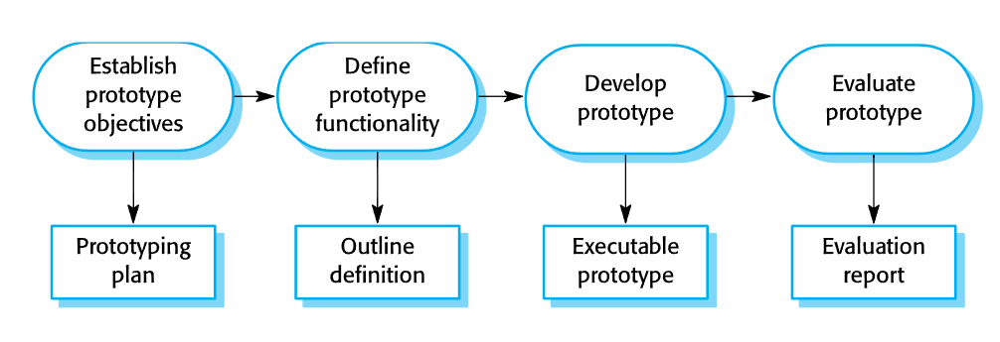 |
|:--:|
| Process of Prototype Development |

- May be based on rapid prototyping languages or tools
- May involve leaving out functionality

#### Incremental Delivery

- The development and delivery is broken down into increments
  - each increment delivering part of the required functionality
  - user requirements are prioritised and the highest priority requirements are included in early increments

- Two approaches:
  - Incremental development: by developer
  - Incremental delivery: for end-user

|  |
|:--:|
| Incremental Delivery |

Advantages:

- System functionality is available earlier
- Early increments act as a prototype
- Lower risk of overall project failure
- Highest priority system services receive most testing

Problems:

- May require a set of basic facilities
- The specification is developed in conjunction with the software

### Process Improvement

- Software process improvement: enhancing the quality of software, reducing costs, or accelerating development processes
- Process improvement: understanding existing processes, and changing these processes

Activities:

- Process measurement: measure one or more attributes of the software process or product. These measurements forms a baseline that helps you decide if process improvements have been effective
- Process analysis: The current process is assessed, and process weaknesses and bottlenecks are identified. Process models (sometimes called process maps) that describe the process may be developed.
- Process change: Process changes are proposed to address some of the identified process weaknesses. These are introduced and the cycle resumes to collect data about the effectiveness of the changes

|  |
|:--:|
| Capability Maturity Model CMM |

| 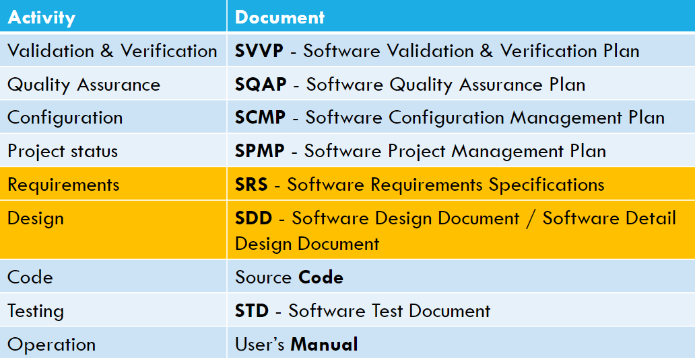 |
|:--:|
| Software Project Documentation |

# Chapter 3-4: Requirement Engineering

Requirement = the descriptions of the system services and constraints. It may range from a high-level abstract statement to a detailed mathematical functional specification.
May serve a dual function The basis for a bid for a contract - must be open to interpretation; The basis for the contract itself - must be in detail

## Functional and Non-functional requirements

- Functional requirements: What system should provide, how the system react to inputs and behave
- Non-functional requirements: Constraints on services or functions as timing, development process, standards, etc. ~ usually on a system scale
- Domain requirements: domain of operations

### Functional requirements

Describe functionality or system services. Maybe high-level statements of what the system should do (should describe in detail)
Ex: *A user shall be able to search the appointments lists for all clinics*

### Non-functional requirements

Define system properties (reliability, response time, storage requirements) and constrains (I/O device capability, system representations, etc.)
Maybe more critical than functional requirements

May generate a number of related functional requirements and may also generate requirements that restrict existing requirements

#### Non-functional Classifications

- Product Requirements: Specify that delivered product must behave in a particular way (execution speed, reliability, etc.)
  - Ex: *The Mentcare system shall be available to all clinics during normal working hours (Mon–Fri, 0830–17.30).*
- Organizational requirements: consequence of organizational policies (process standards used, implementation requirements, etc.)
  - Ex: *Users of the Mentcare system shall authenticate themselves using their health authority identity card.*
- External requirements: Arise from factors which are external to the system and its development process (interoperability, legislative requirements, etc.)
  - Ex: *The system shall implement patient privacy provisions as set out in HStan-03-2006-priv.*
  
### Types of Requirements

- Requirements Definition: A statement in natural language plus diagrams of the services the system provides and its operational constraints. Written for **customers**
- Requirements specification: A structured document setting out detailed descriptions of the system services. Written as a contract between **client and contractor**
- Software specification: A detailed software description which can serve as a basis for a design or implementation. Written for **developers**

### Goals and Requirements

- Goal is a general intention of the user (ex: ease of use), high-level and describe the desired end result, thus less volatile
- Requirements are often concrete, measureable and testable (can be derived through the goal - with detail explanation)

### Stakeholders

- Any person or organization who is affected by the system in some way and so who has a legitimate interest (ex: end users, system managers, system owners, external stakeholders)

## Requirements Engineering Processes

- Processes to “generate” all requirements
- Generic activities common to all processes (elicitation, analysis, validation, management)
- RE is an iterative activity

|  |
|:--:|
| Typical view of the process |

|  |
|:--:|
| Spiral view of the process |

### Requirements Elicitation and Analysis

- Elicitation = Discovery
- Work with customers to find out: application domain, the services and the operational constraints (system performance, hardware constraints, etc.) ~ involve stakeholders

Problems:

- Stakeholders don’t know what they really want
- Stakeholders express requirements in their own terms
- Different stakeholders may have conflicting requirements
- Organisational and political factors may influence the system requirements
- The requirements change during the analysis process as new stakeholders and business environment change

|  |
|:--:|
| The requirements Elicitation and Analysis Process |

#### Discovery Techniques

- Interviewing: Part of most RE processes, can be Closed or Open. Effective when open-minded, avoid pre-conceived ideas about the requirements and are willing to listen to stakeholders. Prompt the interviewee to get discussions going using a springboard question, a requirements proposal, or by working together on a prototype system
- Ethnography: Observational technique used to understand operational processes and help derive support requirements for these processes. A social scientist spends a considerable time observing and analysing how people actually work; People do not have to explain or articulate their work; Social and organisational factors of importance may be observed

|  |
|:--:|
| Requirement Elicitation Techniques |

## Requirement Quality

### Use cases

- A kind of scenario, identify the actors in an interaction and which describe the interaction itself; Included in the UML
- A set of use cases should describe all possible interactions with the system
- UML sequence diagrams may be used to add detail to use-cases (show the sequence of event processing in the system)

### Completeness

- Definition of the responses of the software to all realizable classes of input data in all realizable classes of situations (IEEE Std)
- All possible situations must be covered

### Unambiguous

- every requirement stated therein has only one interpretation (IEEE Std)

| 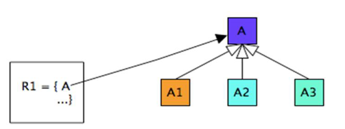 |
|:--:|
| Ambiguity Example |

### Consistent

- A software requirement is internally consistent if, and only if, no subset of individual requirements described in is conflict.

|  |
|:--:|
| Consistent Example |

### Conflict Types

- Specific characteristics of real-world objects
- The logical or temporal conflict between two actions
- Different terms for describing the same real-world

Consistencyt is a challenge since we need a complete overview of all requirements that are related to the same event, functions, parameters

### Possible incorrect requirements

- Forward referencing: requirement items that make use of problem world domain features that have yet defined
  - Example: *ACC system shall maintain the preset speed of an ego-
vehicle if there is no forward vehicle* - who sets the preset speed and what is the value of the speed

|  |
|:--:|
| E, C, D need to be mapped to a requirement item |

- Opacity: requirement items for which rational and dependencies are invisible
  - Example: *Each time the freight train doors are closed, the passengers must all seated* - there is no visible relationship between freight trains and passengers

|  |
|:--:|
| Multiple unrelated concept mapping. A is not related to B |

- Noise: Requirement items that yield no information on problem world features.
  - Example: *The train system shall guarantee safe transportation of all passengers on their residence* - a residence is an unknown concept within the train domain; the train can only transport passengers to the train station and not to their residence

|  |
|:--:|
| X refers to a concept undefined in the domain |

## Requirement Specification

The process of writing down the user and system requirements in a requirements document.
Notes: User requirements have to be understandable by end-users/customers who do not have a technical background; System requirements are more detailed requirements and may include more technical information; These requirements could be part of a contract for the system development

### Ways of writing a system requirements specification

| Notation | Description |
|--------------|-----------|
| Natural Language | Sentences in natural language; each sentence should express one requirement |
| Structured natural language | Natural language statements on a standard form or template |
| Design description languages | Uses a language like a programming language, but with more abstract features |
| Graphical notations | Graphical models, supplemented by text annotations (best for functional requirements); UML use case and sequence diagrams are commonly used |
| Math specifications | Based on math concepts like finite-state machines or sets; can reduce ambiguity but hard to understand (and hard to check manually) |

- For natural language: Used for writing requirements because it is expressive, intuitive and universal - as the requirements can be understood by users and customers. The problems: Lack of clarity/precision, requirement confusion (mixed up functional and non-functional), requirement amalgamation (multiple requirements expressed in 1 statement)
- Structured natural language: Writing on a standard  form or template - with name, I/O, info for computation, action, pre/post-condition, side effects

|  |
|:--:|
| Structured Natural Language Example |

#### Characteristics of Good Software Requirements Specification

**Complete** - **Unambiguous** - **Consistent** - **Correct** - Verifiable - Traceable - Ranked for importance and/or stability - Modifiable

### Use Case Diagram

|  |
|:--:|
| Use Case Diagram |

|  |
|:--:|
| Association Types |

| 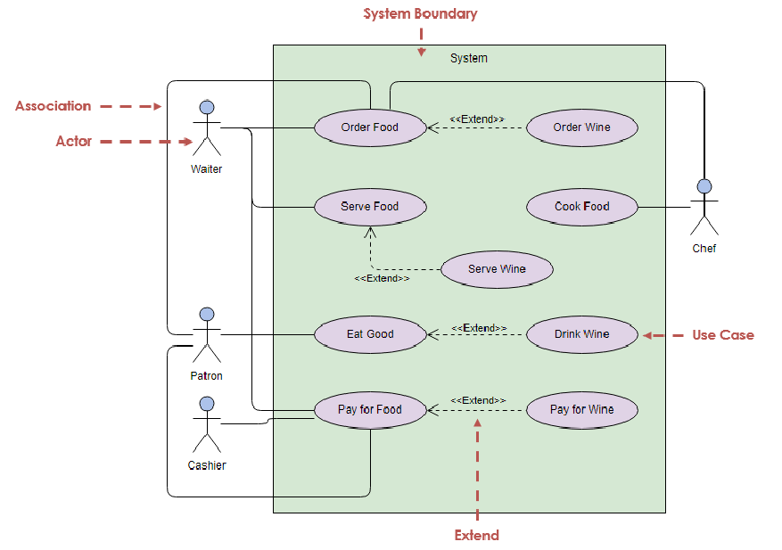 |
|:--:|
| UC Diagram with Association types |

- **Actors** are external entities that interact with the system. These can include users, other systems, or hardware devices. In the context of a Use Case Diagram, actors initiate use cases and receive the outcomes.
- **Use case** is a specific sequence of interactions between an external actor and a system that results in a measurable outcome. These interactions are depicted in the Use Case Diagram, outlining the essential functionalities and behaviors of the system as experienced by the user
- **Relationships between actors and Use Cases**
  - Association: It is depicted by a line connecting the actor to the use case. This relationship signifies that the actor is **involved in the functionality** described by the use case.
  - Include: Indicates that a use case **includes the functionality** of another use case. It is denoted by a dashed arrow pointing from the including use case to the included use case. This relationship promotes modular and **reusable** design.
  - Extend: A use case can be extended by another use case under specific conditions. It is represented by a dashed arrow with the keyword “extend.” This relationship is useful for handling **optional or exceptional behavior**.
  - System Boundary: A visual element that defines the **scope** of the system and separates its internal components from external entities, such as actors. It is represented by a box that encloses all the use cases of the system. The system boundary helps to clarify what is considered part of the system and what lies outside of it.

### Activity Diagram

- Identify candidate use cases, through the examination of business workflows
- Identify pre/post-conditions (context) for use cases
- Model workflows between/within use cases
- Model complex workflows in operations on objects
- Model in detail complex activities in a high level activity Diagram

|  |
|:--:|
| Activity Diagram Notation |

|  |
|:--:|
| Activity Diagram Swim-lane |

| 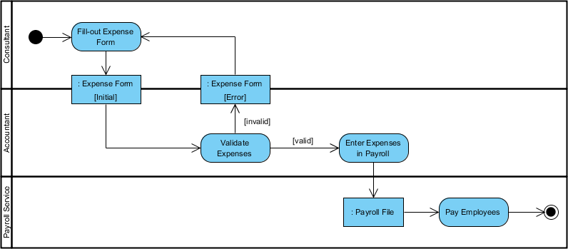 |
|:--:|
| Activity Diagram Swim-lane - 1 |

| 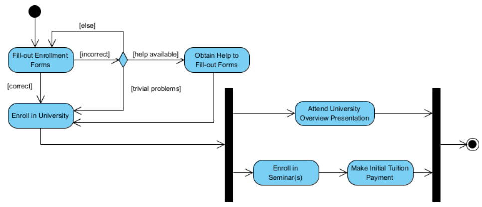 |
|:--:|
| Activity Diagram Standard |

### Sequence Diagram

- interaction diagram that details how operations are carried out -- what messages are sent and when
- Sequence diagrams are organized according to **time**

|  |
|:--:|
| Sequence Diagram |

## Requirement in Agile

### Agile methods and Requirements

- Many Agile methods argue that producing detailed system requirements is a waste of time as requirements change so quickly
- The requirements document is therefore always out of date.
- Agile methods usually use incremental requirements engineering and may express requirements as ‘user stories’
- This is practical for business systems but problematic for systems that require pre-delivery analysis (e.g. critical systems) or systems developed by several teams.

#### User Story

- A user story is a short, simple description of a feature told from the perspective of the person who desires the new capability, usually a user or customer of the system.
- As a *type of user*, I want *some goal* so that *some reason*.
- Stored in a Jira issue
- Are designed to strongly shift the focus from writing about features to discussing with them (more important than text).

| 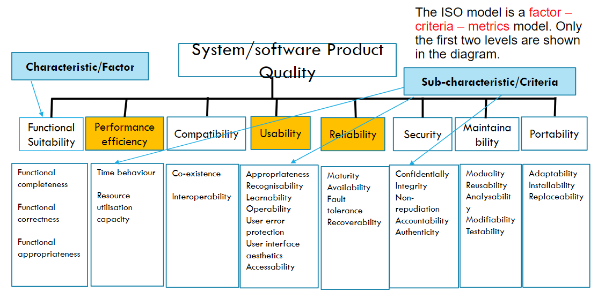 |
|:--:|
| ISO/IEC 25010 Product Quality Model |

## Requirements Validation

- Requirements error can be costly

### Criteria

- Validity: Does the system provide functions which best support the customers' needs?
- Consistency: Are there any requirements conflicts?
- Completeness: Are all functions required by the customer included?
- Realism: Can the requirements be implemented given available budget and tech
- Verifiability: Can the requirements be checked?

### Techniques

- Requirements reviews: Systematic manual analysis of the requirements
- Prototyping: Using an executable model of the system to check requirements
- Test-case generation: Developing tests for requirements to check testability

## Changing requirements

- The business and technical environment of the system always changes after installation
- Conflicting end-users and customers
- Large systems with diverse user community, with different requirements and priorities which are conflicting

### Requirement Management

- Is the process of changing requirements during the requirements engineering process and system development.
- New requirements emerge
- Keep track of individual requirements and maintain links berween dependent requirements so that you can assess the impact of requiremnts changes. You need to establish a **formal** process for making change proposals and linking these to system requirements

#### Planning

Establishes the level of requirements management detail that is required.
Requirements management decisions: Requirements identification, change management process, tracability policies, tool support

#### Changing Management

|  |
|:--:|
| Decide if a requirements change should be accepted |

| 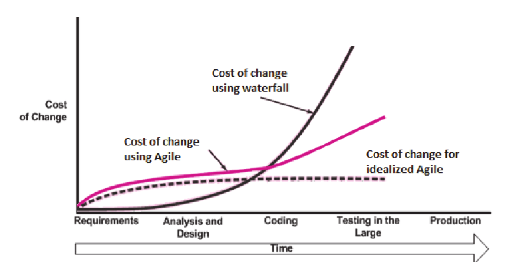 |
|:--:|
| Response to change - Agile approach |

# Chapter 5: OOP

## History

- There are different approaches to writing computer programs: Procedual programming / OOP; but they all involve decomposing your programs into parts
- Simula 1 (1962 - 1965) and Simula 67 (1967) Norwegian Computing Center, Oslo, Norway by Ole-Johan Dahl and Kristen Nygaard.
- Smalltalk (1970s), Alan Kay's group at Xerox PARC
- C++ (early 1980s), Bjarne Stroustrup, Bell Labs

OOP Languages:

- Modula – 3, Oberon, Eiffel, Java, C#, Python
- One of the dominant styles for implementing complex programs with large numbers of interacting components

## Definition

- Based on a hierarchy of classes, and well-defined and cooperating objects
- A class is a structure that defines the data and the methods to work on that data. When you write programs in the Java language, all program data is wrapped in a class, whether it is a class you write or a class you use from the Java platform API libraries.

### Class

- a collection of data (fields/ variables) and methods that operate on that data (define the contents/capabilities of the objects of the class - can be an object factory)

|  |
|:--:|
| Class in Java |

- Object creation: memory is allocated for the object’s fields as defined in the class
- Initialization is specified through a *constructor*; A special method invoked when objects are created
- The current value of an object’s attribute’s determines it’s state.

### Inheritance

- Programming language feature that allows for the implicit definition of variables/methods for a class through an existing class
- An object also inherits: the fields and methods given in the superclass
- A class is not a complete description of its object

#### Classes form a hierarchy

- Classes are arranged in a treelike structure called a hierarchy
- The class at the root is named **Object**
- Every class, except **Object**, has a superclass
- When you define a class, you specify its superclass (if none, **Object** is assumed)

| 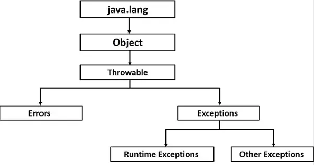 |
|:--:|
| Class Hierarchy |

| 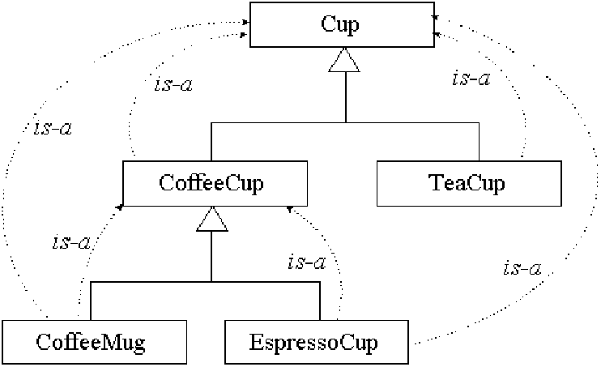 |
|:--:|
| Class Hierarchy - 1|

|  |
|:--:|
| Example of inheritance|

### Encapsulation

- Also know as separation of concerns and information hiding
- When creating new data types (classes) the details of the actual data and the way operations work is hidden from the other programmers who will use those new data types (So they don't have to worry about them or can be change without any ill effects - loose coupling)
- Make easier to use

| 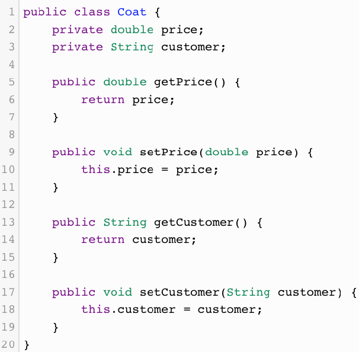 |
|:--:|
| Example of Encapsulation |

### Abstraction

- Hiding implementation detail and only show the functionalities
- Example of abstraction are: encapsulation, inheritance

### Polymorphism

- You can have multiple methods with the same name in the same class
- 2 kinds:
  - Overloading: Methods with different signatures
  - Overriding: Replacing an inherited method with another having the same signature
- Must be different in names - and/or - parameters' types - and/or - parameters order
- A subclass variable can *shadow* a superclass variable; but the subclass method can *override* a superclass method

#### Use case

- Should *overload* a method when you want to do essentially the same thing, but with different parameters
- Should *override* an inherited method if you want to do something slightly different than in the superclass
  - Handy for debugging
  - Test your own objects for equality
  - There are special methods (in java.util.Arrays) that you can use for testing array equality

#### Reuse

- Inheritance encourages software reuse
- Existing code need not be rewritten
- Successful reuse occurs only through careful planning and design (anticipate future modifications and extensions when defining classes)

#### Buld Complex System

As complex systems are difficult to manage, proper use of OOP aids in managing this complexity. The analysis and design of OO systems require corresponding modeling techniques

##### OO Modeling

- UML: Unified Modeling Language (OO Modeling Standard, Booch, Jacobson, Rumbaugh)
- Depicted: Class details and static relationships; System functionality; Object interaction ; State transition within an object
- UML Modeling Techniques: Class diagrams, Use-case diagram, Interation diagrams, State diagrams
- OO Design Model: Static Model (Class Diagram), Dynamic Model (Use Cases, Interaction Diagrams, State Diagrams, etc.)

# Chapter 6: System Modeling

## Overview

- The process of developing abstract models of a system - each model presenting a different view or perspective
- Representing a system using some kind of graphical notation - usually based on notations in the UML
- helps the analyst to understand the functionality and use models to communicate with customers

### Existing and Planned system models

#### Models of the existing system

- Used during requirement engineering
- Help clarify what the existing system does and can be used as a **basis for discussing** its strengths and weaknesses
- These then lead to requirements for the new system

#### New system

- used during requirements engineering to help explain the proposed requirements to other system stakeholders
- Engineers use these models to discuss design proposals and to document the system for implementation

### System Perspectives

- An external perspective: models the context or **environment** of the system
- An interaction perspective: models the **interactions** between a system and its environment, or between the components of a system
- A structural perspective: models the **organization** of a system or the structure of the data that is processed by the system
- A behavioral perspective: models the **dynamic behavior** of the system and how it responds to events

### Use of Graphical Models

- As a means of **facilitating discussion** about an existing or proposed system (maybe incomplete)
- As a way of **documenting** an existing system (accurate representation of the system)
- As a detailed system description that can be used to generate a system **implementation** (both correct and complete)

### UML Diagram Types

Activity diagrams, use-case diagrams, sequence diagrams, class diagrams, state diagrams (show how system reacts to internal/external events)

## External Perspectives

### Context Models

- To illustrate the operational context of a system  and the boundaries - show what lies outside the system boundaries
- Social and organizational concerns may affect the decision on where to position system boundaries
- Architectural models show the system and its relationship with other systems.

### System Boundaries

- Are established to define what is inside and what is outside the system - show relationship to other systems (that dependent on the developing system)

|  |
|:--:|
| Context of Mentcare System |

### Process Perspective

- Context models simply show the other systems in the environment, not how the system being developed is used in that environment.
- Process models reveal how the system being developed is used in **broader business processes**.
- UML activity diagrams may be used to define **business process models**

|  |
|:--:|
| Process model of Involuntary Detention |

## Interaction Perspectives

### Interaction Models

- Modeling user interaction - identify user **requirements**
- Modeling system-to-system interaction - highlights the **communication problems** that may arise
- Modeling component interaction - understand if a proposed **system structure** is likely to deliver the required system performance and dependability.

Use case diagrams and sequence diagrams may be used for interaction modeling

### Use case Modeling

Use cases were developed originally to support requirements elicitation and now incorporated into the UML

- Each use case represents a discrete task that involves external interaction with a system
- Actors in a use case may be people or other systems
- Represented diagrammatically to provide an overview of the use case and in a more detailed textual form

|  |
|:--:|
| Sequence Diagram Notation |

## Structural Perspective

### Structural Models

- Display the organization of a system in terms of the components that make up that system and their relationships
- Structural models may be: static models - system structure; dynamic models - organization during runtime

### Class Diagrams

- Used when developing an object-oriented system model to show the classes in a system and the associations between these classes - An object class can be thought of as a general definition of one kind of system object - An association is a link between classes that indicates that there is some relationship between these classes

|  |
|:--:|
| Class Diagrams |

|  |
|:--:|
| Class Diagrams Notation |

|  |
|:--:|
| Class Diagrams Notation - Method |

|  |
|:--:|
| Multiplicities examples |

## Behavioral Perspectives

- Behavioral models are models of the dynamic behavior of a system during runtime - show what happens or what is supposed to happen when system responds to a stimulus
- Stimuli: Data; Events

### Data-driven modeling

- Show the sequence of actions involved in processing input data and generating an associated output

|  |
|:--:|
| Data-flow Diagrams |

|  |
|:--:|
| Data-flow Diagrams - 1 |

|  |
|:--:|
| Data-flow Diagrams Notation |

### Event-Driven Modeling

- Real-time systems are often event-driven, with minimal data processing
- Shows how a system responds to external and internal events - on the assumption that a system has a finite number of states and that events (stimuli)

|  |
|:--:|
| State Diagram - 1 |

- Superstate encapsulates a number of separate states
- looks like a single state on a high-level model & expanded to show more detail on a separate diagram

|  |
|:--:|
| State Diagram - Superstate |

## UML Stuff

|  |
|:--:|
| Collaboration - Communication Diagrams |

|  |
|:--:|
| Sequence vs. Collaboration Diagrams |

| 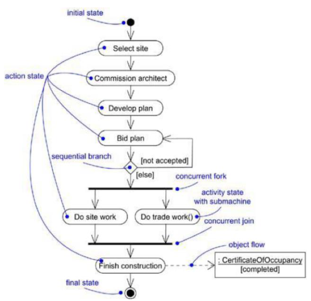 |
|:--:|
| Activity Diagrams |

|  |
|:--:|
| Activity Diagrams - 1 |

# Chapter 7: Architecture Design

## Software Architecture

- Describes how the system is organized as a set of communicating components

## Architectural Design

- Concerned with:  how a software system should be organized and designing the overall structure
  - “build-a-house” metaphor: front end, back end, etc
  - “gardening” metaphor: refactoring, maintenance, etc
- The critical link between design and requirements engineering - identifies the main structural components in a system and the relationships between them
- Agile: An early stage: design an overall systems architecture; Refactoring the system architecture is usually expensive

|  |
|:--:|
| Architecture Example |

### Architectural Abstraction

- In the small: Concerned with architecure of individual programs
- In the large: Concerned wih architecture of complex enterprise systems which include ohter systems, programs, etc.

### Advantages of Explicit Architecture

- Stakeholder **communication**: sed as a focus of discussion by system stakeholders
- System **analysis**: analysis of whether the system can meet its non-functional requirements is possible
- Large-scale **reuse**: may reusable across a range of systems; product-line architectures may be developed

### Architectural Representations

- Mostly use: Simple, informal block diagrams showing entities and relationships - but lack semantics (**verbal** meaning)
- Box and line diagrams: very **abstract** (not show the nature of component relationships nor the externally visible properties of the sub-systems); However, useful for **communication** with stakeholders and for project planning

### Use of Architectural Models

- As a way of facilitating **discussion** about the system design - high-level architectural view is useful for communication with stakeholders and project planning
- As a way of **documenting** an architecture that has been designed - produce a **complete system model** that shows the different **components** in a system, their interfaces and their connections

### Architecture Decomposition

- Software systems: complexity problem <= inter-relationship
- Goals: Maximizing cohesion - Minimizing coupling

**Cohesion**: degree of communication taken place among the module’s elements
**Coupling**: degree of communication among modules

|  |
|:--:|
| Architecture Decomposition |

## Architectural Design Decisions

| 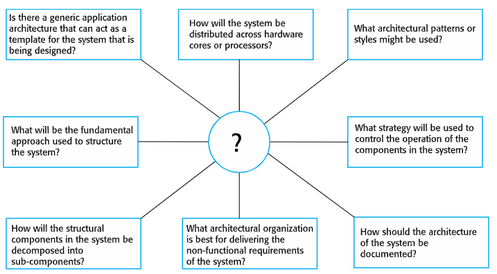 |
|:--:|
| Architectural Design Decisions |

### Architecture and System Characteristics

- Performance: **Localize** critical operations and **minimize** communications. Use large rather than fine-grain components
- Security: Use a **layered** architecture with critical assets in the inner layers.
- Safety: **Localize** safety-critical features in a **small number** of sub-systems
- Availability: Include **redundant** components and mechanisms for **fault tolerance**
- Maintainability: Use fine-grain, replaceable components

## Architectural Views

What views or perspectives are useful when designing and documenting a system’s architecture? What notations should be used? 
Each architectural model only shows one view or perspective of the system - how a system is decomposed into modules; how the run-time processes interact; system components are distributed across a network

|  |
|:--:|
| Architectural Views  - need to present multiple views of the software architecture|

|  |
|:--:|
| 4+1 View model of Software Architecture|

### 4+1 View model vs UML

- Logical view: Class diagram, Communication diagram, Sequence diagram
- Process view: Activity diagram
- Development view: Component diagram, Package diagram
- Physical view: Deployment diagram
- Scenarios (+1): Use-case

## Architectural Patterns

