# Chapter 2: Software Process

Software Engineering is a branch of systems engineering concerned with the
development of large and complex software intensive systems. It focuses on:

- the real-world goals for, services provided by, and constraints on such systems
- the precise specification and implementations
- the activities required in order to develop an assurance that the specifications and
real world-world goals have been met
- the evolution of these systems over time, and across systems families
- It is also concerned with the processes, methods and tools for the development of
software intensive systems in an economic and timely manner

## The Software Process

- A structured set of activities required to develop a software system
- Must involve: Specification, Design and implementation, Validation, Evolution

### Software Process Model

A software process model is an abstract representation of a process

Example: Integration and configuration

- The system is assembled from existing configurable components.
- May be plan-driven or agile.

In practice, most large systems are developed using a process that incorporates elements from all of these models.

#### Waterfall model:

- Plan-driven model
- Separate and distinct phases of specification and development

|  |
|:--:|
| A phase has to be completed before moving to the next phase |

- Drawbacks: difficulty of accommodating change after the process is executing
- Mostly used for large systems engineering projects (where a system is developed at several sites)
- Usually being deployed when the requirements are well-understood thus little changes will be made during the design proces - not realistic when most business systems have unstable requirements

#### Incremental development

- Specification, development and validation are interleaved.
- May be plan-driven or agile.

|  |
|:--:|
| Incremental development |

- Reduce the cost of accommodating changing customer requirements
- Easier to get customer feedback on the development work that has been done.
- More rapid delivery and deployment of useful software to the customer

Problems:

- Process is not visible (managers need regular delivers, not cost-effective to produce documents for every version)
- Degrading system structure as new things are added (need resource on refractoring to improve software, regular change can corrupt system)

#### Agile Development

|  |
|:--:|
| Agile Development |

|  |
|:--:|
| Scrum |

- Benefits: More flexible; Product get to market faster; Better communication
- Drawbacks: Hard to predict; Final product is not released first; Documentation gets left behind

#### Reuse-oriented Software Engineering

- Based on software reuse where systems are integrated from existing components or application systems (COTS - Commercial-off-the-shelf) systems
- Reused elements may be configured to adapt their behaviour and functionality to a user’s requirements
- Reuse is now the standard approach for building many types of business system

|  |
|:--:|
| Reuse-oriented |

- Reduced costs and risks as less software is developed from scratch
- Faster delivery and deployment of system
- But requirements compromises are inevitable so system may not meet real needs of users
- Loss of control over evolution of reused system elements

## Process Activities

Real software processes are inter-leaved sequences of technical, collaborative and managerial activities with the overall goal of specifying, designing, implementing and testing a software system.
The four basic process activities (specified in your book) of specification, development, validation and evolution are organized differently in different development processes
In the waterfall model, they are organized in sequence, whereas in incremental development they are inter-leaved

### Software Specification

Establishing what services are required, constraints on the system’s operation and development
Requirements engineering process: Elicitation and analysis; Specification; Validation

| 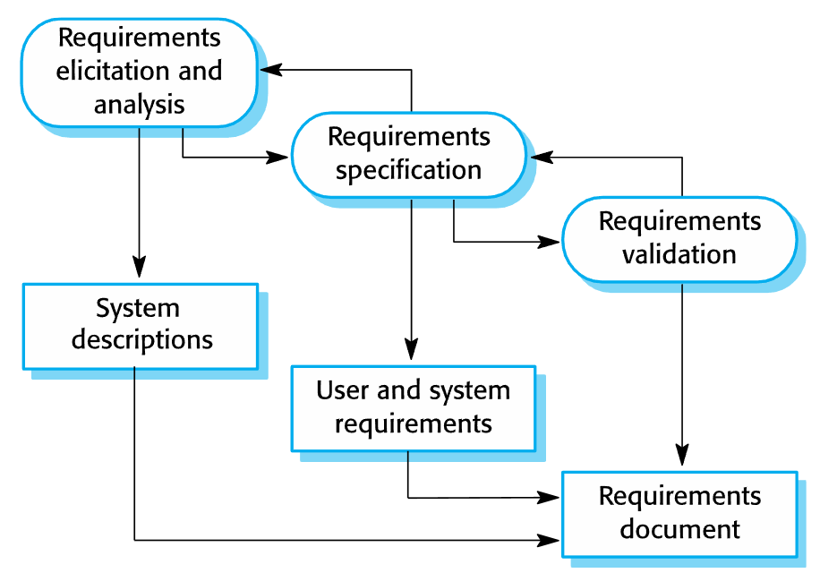 |
|:--:|
| Requirements engineering process |

| 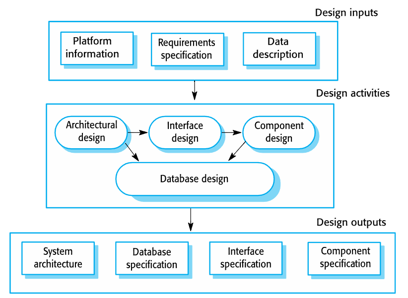 |
|:--:|
| General model of design process |

### System Implementation

- The software is implemented either by developing a program or programs or by configuring an application system
- Design and implementation are interleaved activities for most types of software system
- Programming is an individual activity with no standard process
- Debugging is the activity of finding program faults and correcting these faults

#### Software Validation

- Verification and validation (V & V): to show that a system conforms to its specification and meets the requirements of the system customer
- Involves checking and review processes and system testing (using testcases; most commonly used in V & V)

| 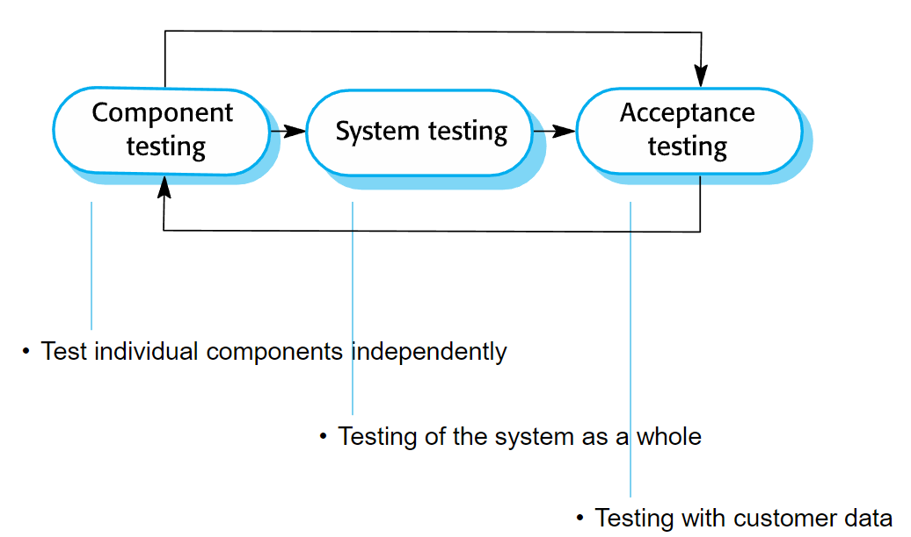 |
|:--:|
| Stages of Testing |

|  |
|:--:|
| Testing phases in a plan-driven software process |

#### Software Evolution

- Software is inherently flexible and can change (like requirements due to business circumstances)

|  |
|:--:|
| Software Evolution |

### Coping with Change

#### Software Prototyping

- A prototype is an initial version of a system used to demonstrate concepts and try out design options
- Used in:
  - requirements engineering process: requirements elicitation and validation
  - design processes: options and develop UI design
  - testing process: run back-to-back test
- Benefits:
  - Improved system usability
  - A closer match to users’ real needs
  - Improved design quality
  - Improved maintainability
  - Reduced development effort

|  |
|:--:|
| Process of Prototype Development |

- May be based on rapid prototyping languages or tools
- May involve leaving out functionality

#### Incremental Delivery

- The development and delivery is broken down into increments
  - each increment delivering part of the required functionality
  - user requirements are prioritised and the highest priority requirements are included in early increments

- Two approaches:
  - Incremental development: by developer
  - Incremental delivery: for end-user

|  |
|:--:|
| Incremental Delivery |

Advantages:

- System functionality is available earlier
- Early increments act as a prototype
- Lower risk of overall project failure
- Highest priority system services receive most testing

Problems:

- May require a set of basic facilities
- The specification is developed in conjunction with the software

### Process Improvement

- Software process improvement: enhancing the quality of software, reducing costs, or accelerating development processes
- Process improvement: understanding existing processes, and changing these processes

Activities:

- Process measurement: measure one or more attributes of the software process or product. These measurements forms a baseline that helps you decide if process improvements have been effective
- Process analysis: The current process is assessed, and process weaknesses and bottlenecks are identified. Process models (sometimes called process maps) that describe the process may be developed.
- Process change: Process changes are proposed to address some of the identified process weaknesses. These are introduced and the cycle resumes to collect data about the effectiveness of the changes

|  |
|:--:|
| Capability Maturity Model CMM |

|  |
|:--:|
| Software Project Documentation |

# Chapter 3-4: Requirement Engineering

Requirement = the descriptions of the system services and constraints. It may range from a high-level abstract statement to a detailed mathematical functional specification.
May serve a dual function The basis for a bid for a contract - must be open to interpretation; The basis for the contract itself - must be in detail

## Functional and Non-functional requirements

- Functional requirements: What system should provide, how the system react to inputs and behave
- Non-functional requirements: Constraints on services or functions as timing, development process, standards, etc. ~ usually on a system scale
- Domain requirements: domain of operations

### Functional requirements

Describe functionality or system services. Maybe high-level statements of what the system should do (should describe in detail)
Ex: *A user shall be able to search the appointments lists for all clinics*

### Non-functional requirements

Define system properties (reliability, response time, storage requirements) and constrains (I/O device capability, system representations, etc.)
Maybe more critical than functional requirements

May generate a number of related functional requirements and may also generate requirements that restrict existing requirements

#### Non-functional Classifications

- Product Requirements: Specify that delivered product must behave in a particular way (execution speed, reliability, etc.)
  - Ex: *The Mentcare system shall be available to all clinics during normal working hours (Mon–Fri, 0830–17.30).*
- Organizational requirements: consequence of organizational policies (process standards used, implementation requirements, etc.)
  - Ex: *Users of the Mentcare system shall authenticate themselves using their health authority identity card.*
- External requirements: Arise from factors which are external to the system and its development process (interoperability, legislative requirements, etc.)
  - Ex: *The system shall implement patient privacy provisions as set out in HStan-03-2006-priv.*
  
### Types of Requirements

- Requirements Definition: A statement in natural language plus diagrams of the services the system provides and its operational constraints. Written for **customers**
- Requirements specification: A structured document setting out detailed descriptions of the system services. Written as a contract between **client and contractor**
- Software specification: A detailed software description which can serve as a basis for a design or implementation. Written for **developers**

### Goals and Requirements

- Goal is a general intention of the user (ex: ease of use), high-level and describe the desired end result, thus less volatile
- Requirements are often concrete, measureable and testable (can be derived through the goal - with detail explanation)

### Stakeholders

- Any person or organization who is affected by the system in some way and so who has a legitimate interest (ex: end users, system managers, system owners, external stakeholders)

## Requirements Engineering Processes

- Processes to “generate” all requirements
- Generic activities common to all processes (elicitation, analysis, validation, management)
- RE is an iterative activity

| 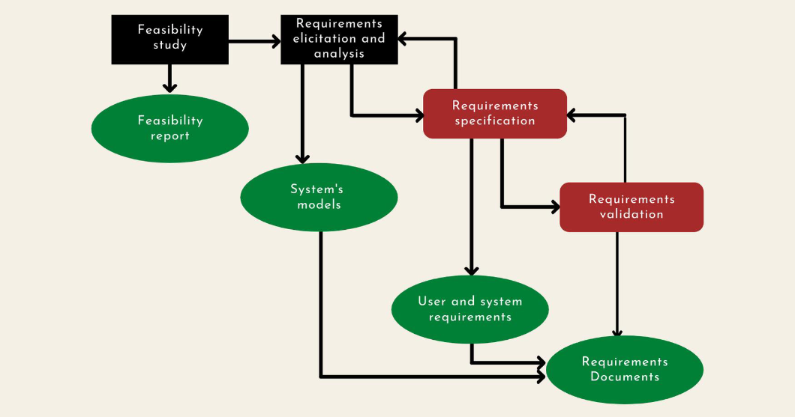 |
|:--:|
| Typical view of the process |

|  |
|:--:|
| Spiral view of the process |

### Requirements Elicitation and Analysis

- Elicitation = Discovery
- Work with customers to find out: application domain, the services and the operational constraints (system performance, hardware constraints, etc.) ~ involve stakeholders

Problems:

- Stakeholders don’t know what they really want
- Stakeholders express requirements in their own terms
- Different stakeholders may have conflicting requirements
- Organisational and political factors may influence the system requirements
- The requirements change during the analysis process as new stakeholders and business environment change

| 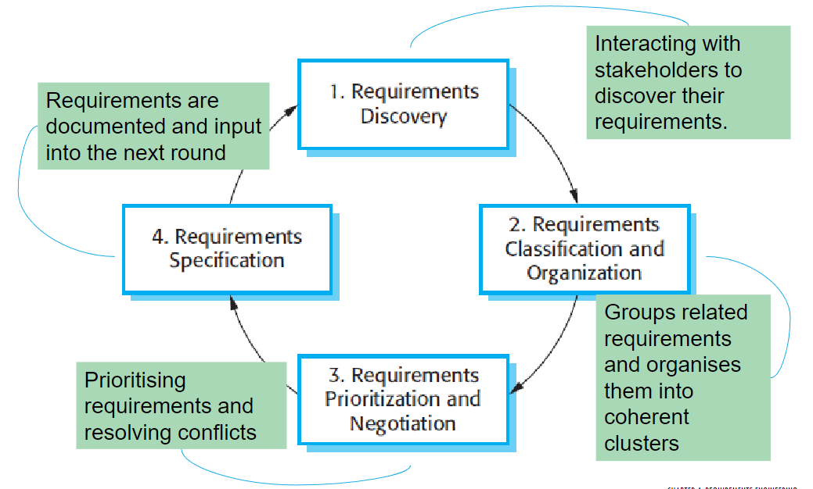 |
|:--:|
| The requirements Elicitation and Analysis Process |

#### Discovery Techniques

- Interviewing: Part of most RE processes, can be Closed or Open. Effective when open-minded, avoid pre-conceived ideas about the requirements and are willing to listen to stakeholders. Prompt the interviewee to get discussions going using a springboard question, a requirements proposal, or by working together on a prototype system
- Ethnography: Observational technique used to understand operational processes and help derive support requirements for these processes. A social scientist spends a considerable time observing and analysing how people actually work; People do not have to explain or articulate their work; Social and organisational factors of importance may be observed

| 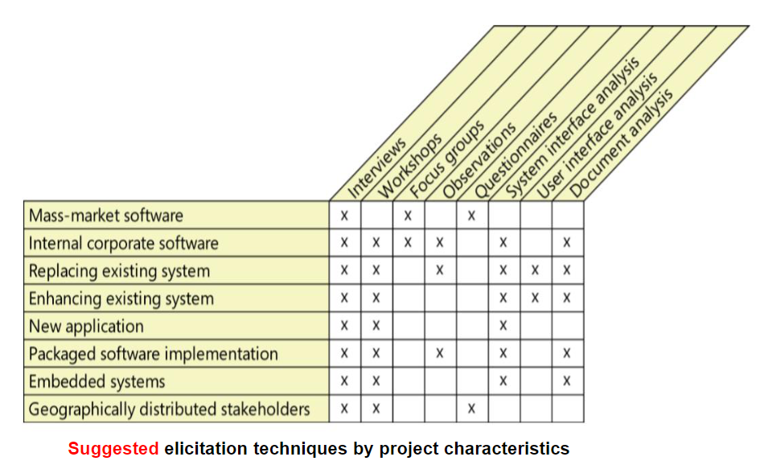 |
|:--:|
| Requirement Elicitation Techniques |

## Requirement Quality

### Use cases

- A kind of scenario, identify the actors in an interaction and which describe the interaction itself; Included in the UML
- A set of use cases should describe all possible interactions with the system
- UML sequence diagrams may be used to add detail to use-cases (show the sequence of event processing in the system)

### Completeness

- Definition of the responses of the software to all realizable classes of input data in all realizable classes of situations (IEEE Std)
- All possible situations must be covered

### Unambiguous

- every requirement stated therein has only one interpretation (IEEE Std)

|  |
|:--:|
| Ambiguity Example |

### Consistent

- A software requirement is internally consistent if, and only if, no subset of individual requirements described in is conflict.

|  |
|:--:|
| Consistent Example |

### Conflict Types

- Specific characteristics of real-world objects
- The logical or temporal conflict between two actions
- Different terms for describing the same real-world

Consistencyt is a challenge since we need a complete overview of all requirements that are related to the same event, functions, parameters

### Possible incorrect requirements

- Forward referencing: requirement items that make use of problem world domain features that have yet defined
  - Example: *ACC system shall maintain the preset speed of an ego-
vehicle if there is no forward vehicle* - who sets the preset speed and what is the value of the speed

| 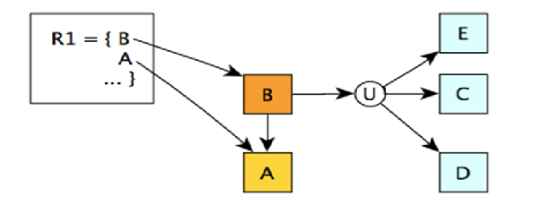 |
|:--:|
| E, C, D need to be mapped to a requirement item |

- Opacity: requirement items for which rational and dependencies are invisible
  - Example: *Each time the freight train doors are closed, the passengers must all seated* - there is no visible relationship between freight trains and passengers

|  |
|:--:|
| Multiple unrelated concept mapping. A is not related to B |

- Noise: Requirement items that yield no information on problem world features.
  - Example: *The train system shall guarantee safe transportation of all passengers on their residence* - a residence is an unknown concept within the train domain; the train can only transport passengers to the train station and not to their residence

|  |
|:--:|
| X refers to a concept undefined in the domain |

## Requirement Specification

The process of writing down the user and system requirements in a requirements document.
Notes: User requirements have to be understandable by end-users/customers who do not have a technical background; System requirements are more detailed requirements and may include more technical information; These requirements could be part of a contract for the system development

### Ways of writing a system requirements specification

| Notation | Description |
|--------------|-----------|
| Natural Language | Sentences in natural language; each sentence should express one requirement |
| Structured natural language | Natural language statements on a standard form or template |
| Design description languages | Uses a language like a programming language, but with more abstract features |
| Graphical notations | Graphical models, supplemented by text annotations (best for functional requirements); UML use case and sequence diagrams are commonly used |
| Math specifications | Based on math concepts like finite-state machines or sets; can reduce ambiguity but hard to understand (and hard to check manually) |

- For natural language: Used for writing requirements because it is expressive, intuitive and universal - as the requirements can be understood by users and customers. The problems: Lack of clarity/precision, requirement confusion (mixed up functional and non-functional), requirement amalgamation (multiple requirements expressed in 1 statement)
- Structured natural language: Writing on a standard  form or template - with name, I/O, info for computation, action, pre/post-condition, side effects

| 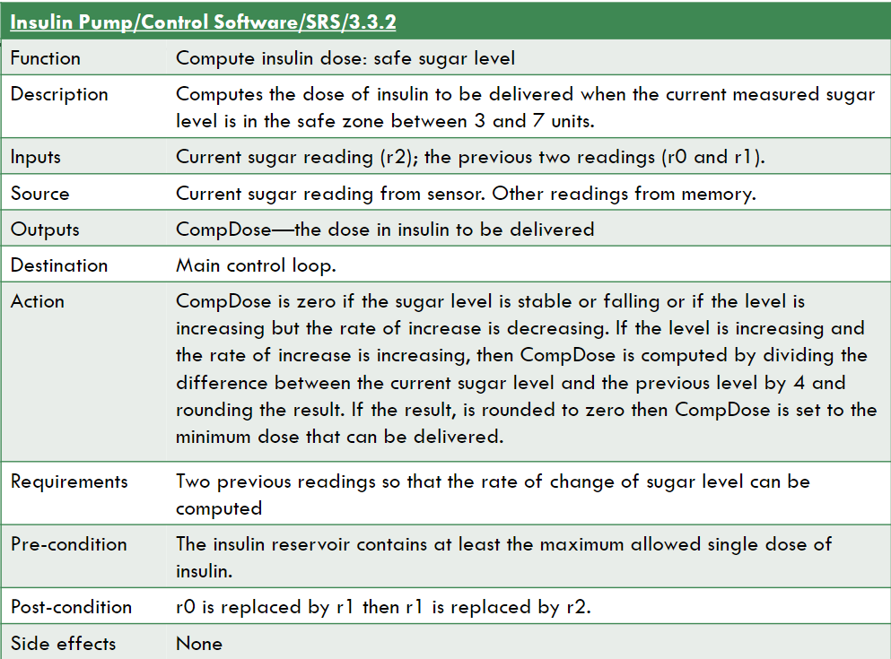 |
|:--:|
| Structured Natural Language Example |

#### Characteristics of Good Software Requirements Specification

**Complete** - **Unambiguous** - **Consistent** - **Correct** - Verifiable - Traceable - Ranked for importance and/or stability - Modifiable

### Use Case Diagram

| 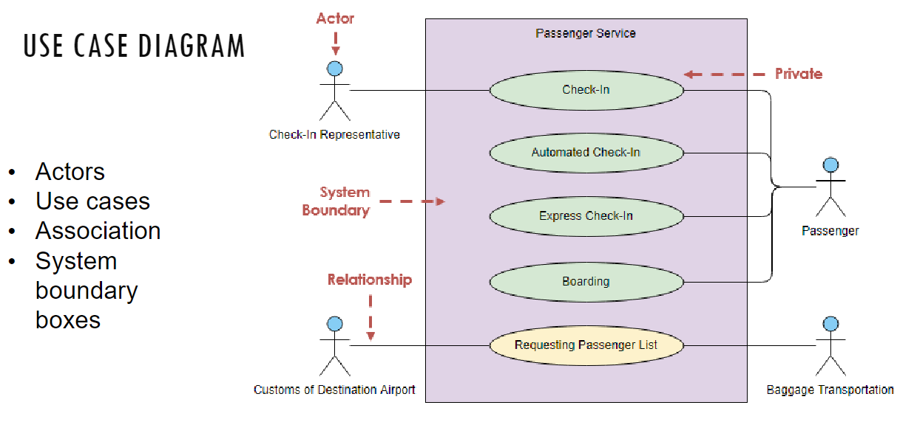 |
|:--:|
| Use Case Diagram |

|  |
|:--:|
| Association Types |

|  |
|:--:|
| UC Diagram with Association types |

- **Actors** are external entities that interact with the system. These can include users, other systems, or hardware devices. In the context of a Use Case Diagram, actors initiate use cases and receive the outcomes.
- **Use case** is a specific sequence of interactions between an external actor and a system that results in a measurable outcome. These interactions are depicted in the Use Case Diagram, outlining the essential functionalities and behaviors of the system as experienced by the user
- **Relationships between actors and Use Cases**
  - Association: It is depicted by a line connecting the actor to the use case. This relationship signifies that the actor is **involved in the functionality** described by the use case.
  - Include: Indicates that a use case **includes the functionality** of another use case. It is denoted by a dashed arrow pointing from the including use case to the included use case. This relationship promotes modular and **reusable** design.
  - Extend: A use case can be extended by another use case under specific conditions. It is represented by a dashed arrow with the keyword “extend.” This relationship is useful for handling **optional or exceptional behavior**.
  - System Boundary: A visual element that defines the **scope** of the system and separates its internal components from external entities, such as actors. It is represented by a box that encloses all the use cases of the system. The system boundary helps to clarify what is considered part of the system and what lies outside of it.

### Activity Diagram

- Identify candidate use cases, through the examination of business workflows
- Identify pre/post-conditions (context) for use cases
- Model workflows between/within use cases
- Model complex workflows in operations on objects
- Model in detail complex activities in a high level activity Diagram

|  |
|:--:|
| Activity Diagram Notation |

|  |
|:--:|
| Activity Diagram Swim-lane |

|  |
|:--:|
| Activity Diagram Swim-lane - 1 |

|  |
|:--:|
| Activity Diagram Standard |

### Sequence Diagram

- interaction diagram that details how operations are carried out -- what messages are sent and when
- Sequence diagrams are organized according to **time**

|  |
|:--:|
| Sequence Diagram |

## Requirement in Agile

### Agile methods and Requirements

- Many Agile methods argue that producing detailed system requirements is a waste of time as requirements change so quickly
- The requirements document is therefore always out of date.
- Agile methods usually use incremental requirements engineering and may express requirements as ‘user stories’
- This is practical for business systems but problematic for systems that require pre-delivery analysis (e.g. critical systems) or systems developed by several teams.

#### User Story

- A user story is a short, simple description of a feature told from the perspective of the person who desires the new capability, usually a user or customer of the system.
- As a *type of user*, I want *some goal* so that *some reason*.
- Stored in a Jira issue
- Are designed to strongly shift the focus from writing about features to discussing with them (more important than text).

|  |
|:--:|
| ISO/IEC 25010 Product Quality Model |

## Requirements Validation

- Requirements error can be costly

### Criteria

- Validity: Does the system provide functions which best support the customers' needs?
- Consistency: Are there any requirements conflicts?
- Completeness: Are all functions required by the customer included?
- Realism: Can the requirements be implemented given available budget and tech
- Verifiability: Can the requirements be checked?

### Techniques

- Requirements reviews: Systematic manual analysis of the requirements
- Prototyping: Using an executable model of the system to check requirements
- Test-case generation: Developing tests for requirements to check testability

## Changing requirements

- The business and technical environment of the system always changes after installation
- Conflicting end-users and customers
- Large systems with diverse user community, with different requirements and priorities which are conflicting

### Requirement Management

- Is the process of changing requirements during the requirements engineering process and system development.
- New requirements emerge
- Keep track of individual requirements and maintain links berween dependent requirements so that you can assess the impact of requiremnts changes. You need to establish a **formal** process for making change proposals and linking these to system requirements

#### Planning

Establishes the level of requirements management detail that is required.
Requirements management decisions: Requirements identification, change management process, tracability policies, tool support

#### Changing Management

|  |
|:--:|
| Decide if a requirements change should be accepted |

|  |
|:--:|
| Response to change - Agile approach |

# Chapter 5: OOP

## History

- There are different approaches to writing computer programs: Procedual programming / OOP; but they all involve decomposing your programs into parts
- Simula 1 (1962 - 1965) and Simula 67 (1967) Norwegian Computing Center, Oslo, Norway by Ole-Johan Dahl and Kristen Nygaard.
- Smalltalk (1970s), Alan Kay's group at Xerox PARC
- C++ (early 1980s), Bjarne Stroustrup, Bell Labs

OOP Languages:

- Modula – 3, Oberon, Eiffel, Java, C#, Python
- One of the dominant styles for implementing complex programs with large numbers of interacting components

## Definition

- Based on a hierarchy of classes, and well-defined and cooperating objects
- A class is a structure that defines the data and the methods to work on that data. When you write programs in the Java language, all program data is wrapped in a class, whether it is a class you write or a class you use from the Java platform API libraries.

### Class

- a collection of data (fields/ variables) and methods that operate on that data (define the contents/capabilities of the objects of the class - can be an object factory)

| 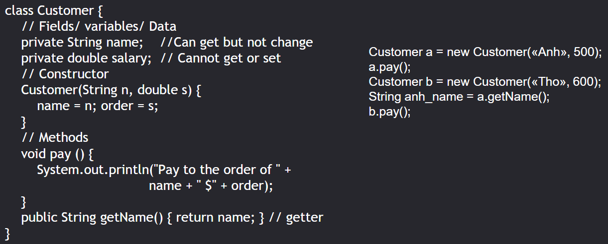 |
|:--:|
| Class in Java |

- Object creation: memory is allocated for the object’s fields as defined in the class
- Initialization is specified through a *constructor*; A special method invoked when objects are created
- The current value of an object’s attribute’s determines it’s state.

### Inheritance

- Programming language feature that allows for the implicit definition of variables/methods for a class through an existing class
- An object also inherits: the fields and methods given in the superclass
- A class is not a complete description of its object

#### Classes form a hierarchy

- Classes are arranged in a treelike structure called a hierarchy
- The class at the root is named **Object**
- Every class, except **Object**, has a superclass
- When you define a class, you specify its superclass (if none, **Object** is assumed)

|  |
|:--:|
| Class Hierarchy |

|  |
|:--:|
| Class Hierarchy - 1|

| 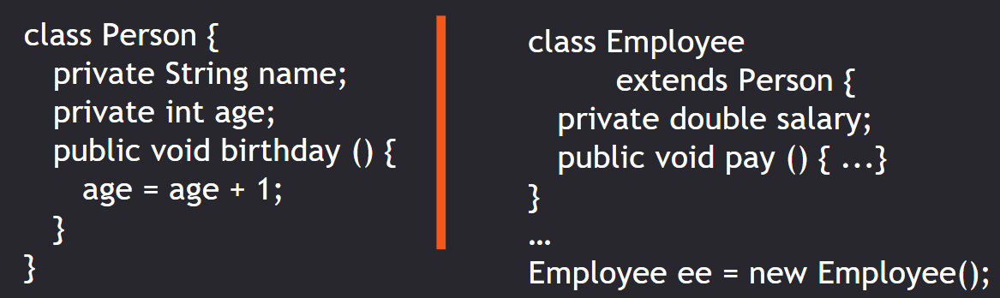 |
|:--:|
| Example of inheritance|

### Encapsulation

- Also know as separation of concerns and information hiding
- When creating new data types (classes) the details of the actual data and the way operations work is hidden from the other programmers who will use those new data types (So they don't have to worry about them or can be change without any ill effects - loose coupling)
- Make easier to use

|  |
|:--:|
| Example of Encapsulation |

### Abstraction

- Hiding implementation detail and only show the functionalities
- Example of abstraction are: encapsulation, inheritance

### Polymorphism

- You can have multiple methods with the same name in the same class
- 2 kinds:
  - Overloading: Methods with different signatures
  - Overriding: Replacing an inherited method with another having the same signature
- Must be different in names - and/or - parameters' types - and/or - parameters order
- A subclass variable can *shadow* a superclass variable; but the subclass method can *override* a superclass method

#### Use case

- Should *overload* a method when you want to do essentially the same thing, but with different parameters
- Should *override* an inherited method if you want to do something slightly different than in the superclass
  - Handy for debugging
  - Test your own objects for equality
  - There are special methods (in java.util.Arrays) that you can use for testing array equality

#### Reuse

- Inheritance encourages software reuse
- Existing code need not be rewritten
- Successful reuse occurs only through careful planning and design (anticipate future modifications and extensions when defining classes)

#### Buld Complex System

As complex systems are difficult to manage, proper use of OOP aids in managing this complexity. The analysis and design of OO systems require corresponding modeling techniques

##### OO Modeling

- UML: Unified Modeling Language (OO Modeling Standard, Booch, Jacobson, Rumbaugh)
- Depicted: Class details and static relationships; System functionality; Object interaction ; State transition within an object
- UML Modeling Techniques: Class diagrams, Use-case diagram, Interation diagrams, State diagrams
- OO Design Model: Static Model (Class Diagram), Dynamic Model (Use Cases, Interaction Diagrams, State Diagrams, etc.)

# Chapter 6: System Modeling

## Overview

- The process of developing abstract models of a system - each model presenting a different view or perspective
- Representing a system using some kind of graphical notation - usually based on notations in the UML
- helps the analyst to understand the functionality and use models to communicate with customers

### Existing and Planned system models

#### Models of the existing system

- Used during requirement engineering
- Help clarify what the existing system does and can be used as a **basis for discussing** its strengths and weaknesses
- These then lead to requirements for the new system

#### New system

- used during requirements engineering to help explain the proposed requirements to other system stakeholders
- Engineers use these models to discuss design proposals and to document the system for implementation

### System Perspectives

- An external perspective: models the context or **environment** of the system
- An interaction perspective: models the **interactions** between a system and its environment, or between the components of a system
- A structural perspective: models the **organization** of a system or the structure of the data that is processed by the system
- A behavioral perspective: models the **dynamic behavior** of the system and how it responds to events

### Use of Graphical Models

- As a means of **facilitating discussion** about an existing or proposed system (maybe incomplete)
- As a way of **documenting** an existing system (accurate representation of the system)
- As a detailed system description that can be used to generate a system **implementation** (both correct and complete)

### UML Diagram Types

Activity diagrams, use-case diagrams, sequence diagrams, class diagrams, state diagrams (show how system reacts to internal/external events)

## External Perspectives

### Context Models

- To illustrate the operational context of a system  and the boundaries - show what lies outside the system boundaries
- Social and organizational concerns may affect the decision on where to position system boundaries
- Architectural models show the system and its relationship with other systems.

### System Boundaries

- Are established to define what is inside and what is outside the system - show relationship to other systems (that dependent on the developing system)

| 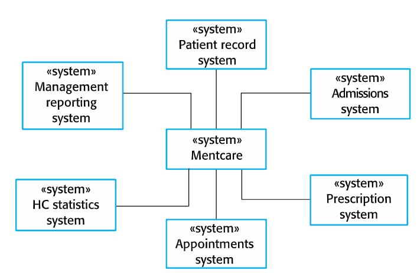 |
|:--:|
| Context of Mentcare System |

### Process Perspective

- Context models simply show the other systems in the environment, not how the system being developed is used in that environment.
- Process models reveal how the system being developed is used in **broader business processes**.
- UML activity diagrams may be used to define **business process models**

|  |
|:--:|
| Process model of Involuntary Detention |

## Interaction Perspectives

### Interaction Models

- Modeling user interaction - identify user **requirements**
- Modeling system-to-system interaction - highlights the **communication problems** that may arise
- Modeling component interaction - understand if a proposed **system structure** is likely to deliver the required system performance and dependability.

Use case diagrams and sequence diagrams may be used for interaction modeling

### Use case Modeling

Use cases were developed originally to support requirements elicitation and now incorporated into the UML

- Each use case represents a discrete task that involves external interaction with a system
- Actors in a use case may be people or other systems
- Represented diagrammatically to provide an overview of the use case and in a more detailed textual form

| 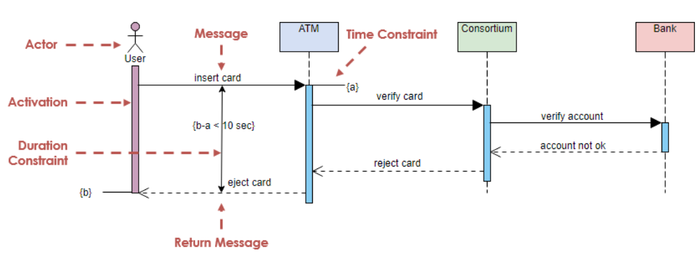 |
|:--:|
| Sequence Diagram Notation |

## Structural Perspective

### Structural Models

- Display the organization of a system in terms of the components that make up that system and their relationships
- Structural models may be: static models - system structure; dynamic models - organization during runtime

### Class Diagrams

- Used when developing an object-oriented system model to show the classes in a system and the associations between these classes - An object class can be thought of as a general definition of one kind of system object - An association is a link between classes that indicates that there is some relationship between these classes

| 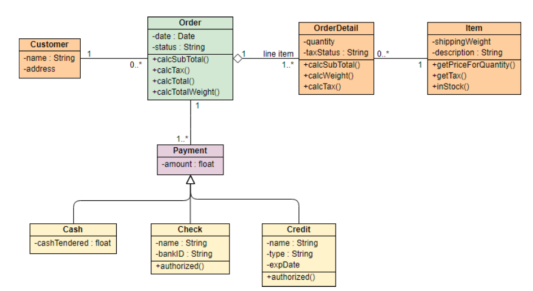 |
|:--:|
| Class Diagrams |

| 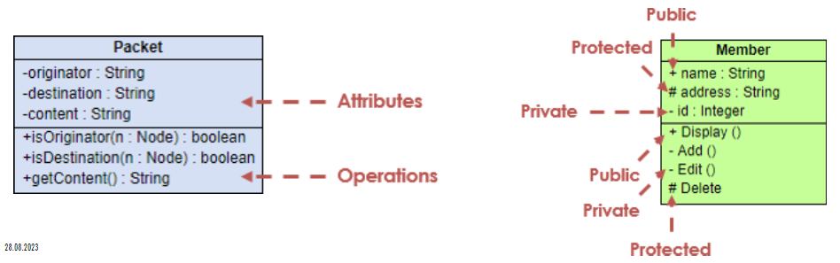 |
|:--:|
| Class Diagrams Notation |

|  |
|:--:|
| Class Diagrams Notation - Method |

|  |
|:--:|
| Multiplicities examples |

## Behavioral Perspectives

- Behavioral models are models of the dynamic behavior of a system during runtime - show what happens or what is supposed to happen when system responds to a stimulus
- Stimuli: Data; Events

### Data-driven modeling

- Show the sequence of actions involved in processing input data and generating an associated output

|  |
|:--:|
| Data-flow Diagrams |

| 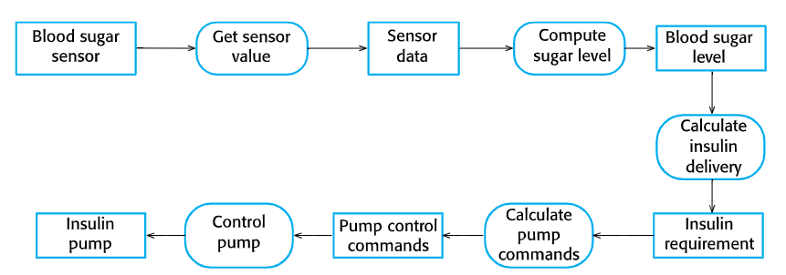 |
|:--:|
| Data-flow Diagrams - 1 |

|  |
|:--:|
| Data-flow Diagrams Notation |

### Event-Driven Modeling

- Real-time systems are often event-driven, with minimal data processing
- Shows how a system responds to external and internal events - on the assumption that a system has a finite number of states and that events (stimuli)

| 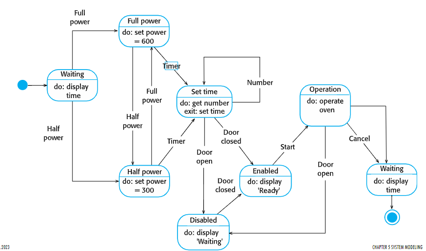 |
|:--:|
| State Diagram - 1 |

- Superstate encapsulates a number of separate states
- looks like a single state on a high-level model & expanded to show more detail on a separate diagram

| 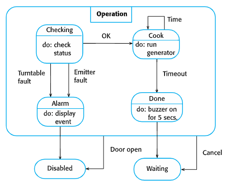 |
|:--:|
| State Diagram - Superstate |

## UML Stuff

| 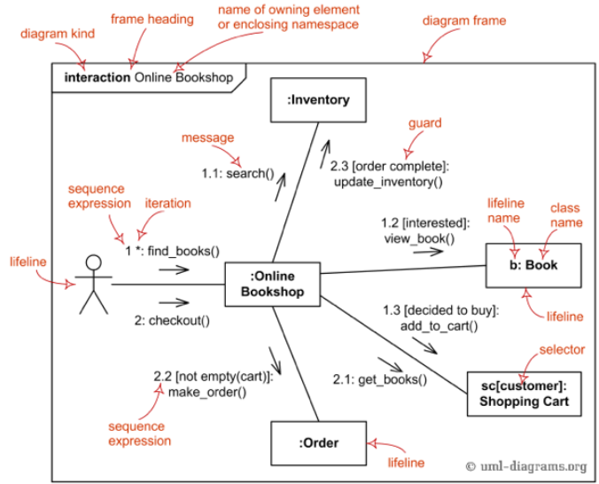 |
|:--:|
| Collaboration - Communication Diagrams |

| 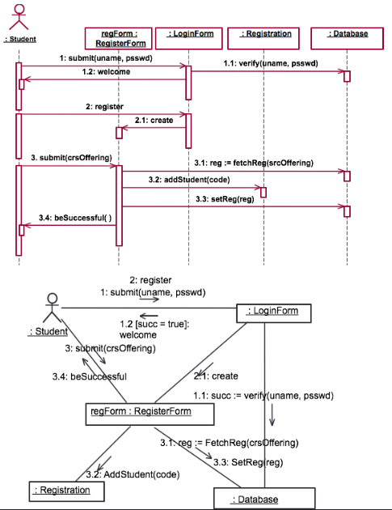 |
|:--:|
| Sequence vs. Collaboration Diagrams |

|  |
|:--:|
| Activity Diagrams |

| 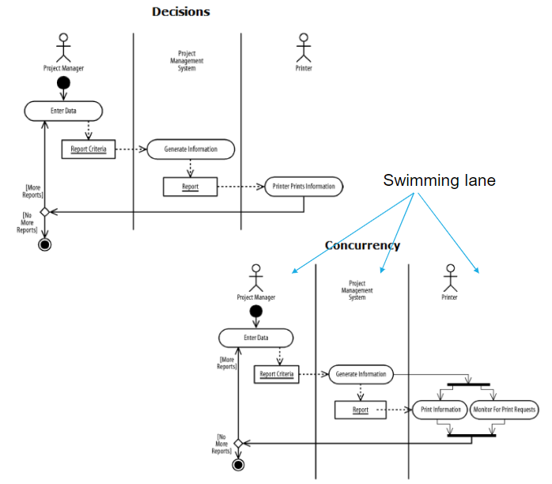 |
|:--:|
| Activity Diagrams - 1 |

# Chapter 7: Architecture Design

## Software Architecture

- Describes how the system is organized as a set of communicating components

## Architectural Design

- Concerned with:  how a software system should be organized and designing the overall structure
  - “build-a-house” metaphor: front end, back end, etc
  - “gardening” metaphor: refactoring, maintenance, etc
- The critical link between design and requirements engineering - identifies the main structural components in a system and the relationships between them
- Agile: An early stage: design an overall systems architecture; Refactoring the system architecture is usually expensive

| 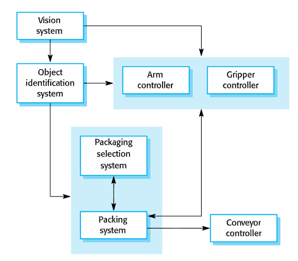 |
|:--:|
| Architecture Example |

### Architectural Abstraction

- In the small: Concerned with architecure of individual programs
- In the large: Concerned wih architecture of complex enterprise systems which include ohter systems, programs, etc.

### Advantages of Explicit Architecture

- Stakeholder **communication**: sed as a focus of discussion by system stakeholders
- System **analysis**: analysis of whether the system can meet its non-functional requirements is possible
- Large-scale **reuse**: may reusable across a range of systems; product-line architectures may be developed

### Architectural Representations

- Mostly use: Simple, informal block diagrams showing entities and relationships - but lack semantics (**verbal** meaning)
- Box and line diagrams: very **abstract** (not show the nature of component relationships nor the externally visible properties of the sub-systems); However, useful for **communication** with stakeholders and for project planning

### Use of Architectural Models

- As a way of facilitating **discussion** about the system design - high-level architectural view is useful for communication with stakeholders and project planning
- As a way of **documenting** an architecture that has been designed - produce a **complete system model** that shows the different **components** in a system, their interfaces and their connections

### Architecture Decomposition

- Software systems: complexity problem <= inter-relationship
- Goals: Maximizing cohesion - Minimizing coupling

**Cohesion**: degree of communication taken place among the module’s elements
**Coupling**: degree of communication among modules

| 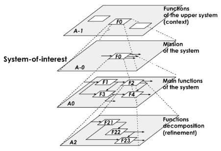 |
|:--:|
| Architecture Decomposition |

## Architectural Design Decisions

|  |
|:--:|
| Architectural Design Decisions |

### Architecture and System Characteristics

- Performance: **Localize** critical operations and **minimize** communications. Use large rather than fine-grain components
- Security: Use a **layered** architecture with critical assets in the inner layers.
- Safety: **Localize** safety-critical features in a **small number** of sub-systems
- Availability: Include **redundant** components and mechanisms for **fault tolerance**
- Maintainability: Use fine-grain, replaceable components

## Architectural Views

What views or perspectives are useful when designing and documenting a system’s architecture? What notations should be used? 
Each architectural model only shows one view or perspective of the system - how a system is decomposed into modules; how the run-time processes interact; system components are distributed across a network

|  |
|:--:|
| Architectural Views  - need to present multiple views of the software architecture |

|  |
|:--:|
| 4+1 View model of Software Architecture |

### 4+1 View model vs UML

- Logical view: Class diagram, Communication diagram, Sequence diagram
- Process view: Activity diagram
- Development view: Component diagram, Package diagram
- Physical view: Deployment diagram
- Scenarios (+1): Use-case

## Architectural Patterns

- Patterns are a means of representing, sharing and reusing knowledge -  should include information about when they are/aren't usefull;  may be represented using tabular and graphical descriptions
- An architectural pattern is a stylized description of good **design practice**, which has been tried and **tested** in different environments.

### The model-view-controller (MVC) Pattern

| Name | MVC (Model-view-controller) |
|--------------|-----------|
| Description | Separates **presentation and interaction** from the system data. The system is structured into three logical components that **interact** with each other. The **Model** component manages the system **data** and associated operations on that data. The **View** component defines and manages how the data is **presented** to the user. The **Controller** component manages user **interaction** (e.g., key presses, mouse clicks, etc.) and passes these interactions to the View and the Model. |
| When used | Used when there are multiple ways to view and interact with data. Also used when the future requirements for interaction and presentation of data are unknown ~ **unstable presentation** |
| Advantages | Allows the data to **change** independently of its representation and vice versa. Supports presentation of the same data in different ways with changes made in one representation shown in all of them. |
| Disadvantages | Can involve additional code and code **complexity** when the data model and interactions are simple. |

| 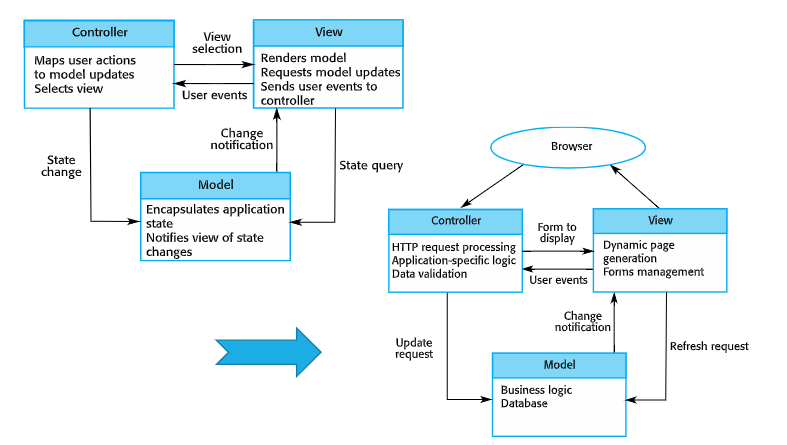 |
|:--:|
| Conceptual View of the MVC and Web-based MVC |

### Layered Architecture Pattern

| Name | Layered architecture |
|--------------|-----------|
| Description | Organizes the system into layers with related functionality associated with each layer. A layer provides services to the layer above it so the lowest-level layers represent core services that are likely to be used throughout the system. ~ **recursion** |
| When used | Used when building new facilities **on top** of existing systems; when the development is **spread** across several teams with each team responsibility for a layer of functionality; when there is a requirement for multi-level **security**. |
| Advantages | Allows **replacement** of entire layers so long as the interface is maintained. Redundant facilities (e.g., authentication) can be provided in each layer to increase the **dependability** of the system. |
| Disadvantages | In practice, providing a **clean separation** between layers is often difficult and a high-level layer may have to **interact** directly with lower-level layers rather than through the layer immediately below it. **Performance** can be a problem because of multiple levels of interpretation of a service request as it is processed at each layer. |

|  |
|:--:|
| A Generic layered Architecture |

### Repository Architecture

- Sub-systems must **exchange data**. This may be done in two ways: Shared data is held in a **central database** or repository and may be accessed by all sub-systems; Each **sub-system** maintains its own database and passes data explicitly to other sub-systems
- When large amounts of data are to be shared, the **repository** model of sharing is most commonly used a this is an efficient data sharing mechanism

| Name | Repository |
|--------------|-----------|
| Description | All data in a system is managed in a **central repository** that is accessible to all system components. Components do not interact directly, only through the repository. |
| When used | You should use this pattern when you have a system in which **large volumes of information** are generated that has to be stored for a **long time**. You may also use it in data-driven systems where the inclusion of data in the repository triggers an action or tool. |
| Advantages | Components can be **independent**—they do not need to know of the existence of other components. Changes made by one component can be **propagated** to all components. All data can be managed consistently (e.g., backups done at the same time) as it is all in one place. |
| Disadvantages | The repository is a single point of **failure** so problems in the repository affect the whole system. May be **inefficiencies** in organizing all communication through the repository. **Distributing** the repository across several computers may be difficult. |

| 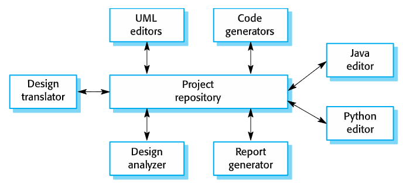 |
|:--:|
| A Repository Architecture for an IDE |

### Client-server Pattern

| Name | Client-server |
|--------------|-----------|
| Description | In a client–server architecture, the functionality of the system is organized into **services**, with each service delivered from a separate server. Clients are users of these services and access servers to make use of them. |
| When used | Used when data in a **shared database** has to be accessed from a range of locations. Because **servers can be replicated**, may also be used when the load on a system is variable. |
| Advantages | The principal advantage of this model is that servers can be **distributed** across a **network**. General functionality (e.g., a printing service) can be available to all clients and does not need to be implemented by all services. |
| Disadvantages | Each service is a single point of failure so susceptible to denial of service attacks or server failure. Performance may be **unpredictable** because it depends on the network as well as the system. May be management problems if servers are owned by different organizations. |

|  |
|:--:|
| A client-server architecture for a film library |

### Pipe and Filter Pattern

| Name | Pipe and Filter |
|--------------|-----------|
| Description | The processing of the data in a system is organized so that each processing component (filter) is **discrete** and carries out one type of data transformation. The **data flows** (as in a pipe) from one component to another for processing. |
| When used | Commonly used in **data processing applications** (both batch- and transaction-based) where inputs are processed in separate stages to generate related outputs. |
| Advantages | **Easy** to understand and supports transformation reuse. **Workflow style** matches the structure of many business processes. Evolution by adding transformations is straightforward. Can be implemented as either a sequential or concurrent system. |
| Disadvantages | The **format** for data transfer has to be agreed upon between communicating transformations. Each transformation must parse its input and unparse its output to the agreed form. This increases system **overhead** and may mean that it is impossible to reuse functional transformations that use incompatible data structures. |

|  |
|:--:|
| Example of Pipe and Filter Architecture for processing invoice |

### Monolithic - Microservice Architecture

| Monolithic architecture | Microservices architecture |
|--------------|-----------|
| Simple to develop and deploy | Complex and hard to develop and deploy |
| Interconnectivity | Autonomy |
| Code changes affect the entire system | Only the microservice that is changed would be affected |
| Inter-service communication | Using APIs for communication |
| Simple testing - The entire system will be tested at once. | Testing is much more complex - Done on a per unit or component level after which a system-wide test can then be done |
| One codebase and one shared database | A codebase and database for each microservice |
| Hard to scale or upgrade | Very scalable and upgrade |
| Less expensive and faster to develop | More expensive and takes more time to develop |
| The entire system can be affected by a single error or bug | The entire system is shielded from the error or bug on one sub service |

## Application Architectures

- Application systems are designed to meet an organizational need - businesses have much in common, their application systems also tend to have a **common architecture** that reflects the application requirements
- A generic application architecture is an architecture for a type of software system that may be configured and adapted to create a system that meets specific requirements

### Use of Application Architectures

As a **starting point** for architectural design; design checklist; way of **organising** the work of the development team; means of **assessing** components for reuse; a **vocabulary** for talking about application types

### Example of Application Types

- **Transaction** processing applications - Database-centred applications that process user requests and update information in a system database
- Event processing systems - Applications where system actions depend on interpreting events from the system’s environment
- Language processing systems - Applications where the users’ intentions are specified in a formal language that is processed and interpreted by the system

#### Transaction Processing Systems

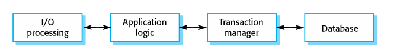

- Process user requests for information (**query**) from a database or requests to **update** the database
- From a user perspective a transaction is: Any coherent sequence of operations that satisfies a **goal** (find the times of flights from London to Paris)
- Users make **asynchronous** requests for service which are then processed by a transaction manager

| 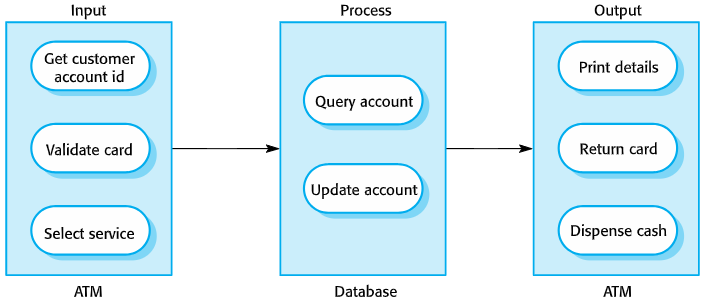 |
|:--:|
| Software Architecture of an ATM system |

#### Information Systems Architecture

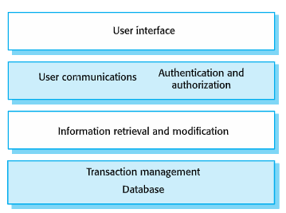

- Information systems have a generic architecture that can be organized as a **layered** architecture
- These are transaction-based systems as interaction with these systems generally involves **database transactions**
- Layers include: UI, User communication, Information retrieval, System database

| 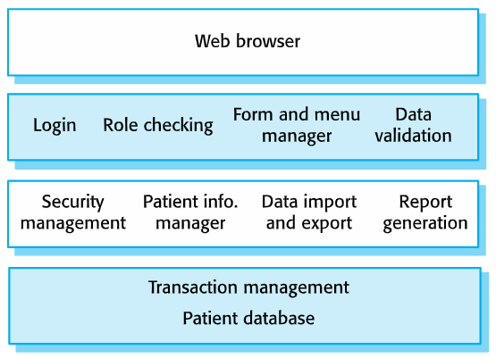 |
|:--:|
| The architecture of the Mentcare System |

##### Web-based Information System

- Information and resource management systems are now usually web-based systems where the user interfaces are implemented using a web browser
- Often implemented as multi-tier client/server architectures
  - The web server is responsible for **all** user **communications**, with the user interface implemented using a web browser
  - The application server is responsible for implementing **application-specific logic** as well as information **storage** and retrieval requests
  - The database server moves information to and from the database and handles transaction management

#### Language Processing System

- Accept a natural or artificial language as input and generate some other **representation** of that language
- May include an **interpreter** to act on the instructions in the language that is being processed
- Used in situations where the easiest way to solve a problem is to **describe** an algorithm or describe the system data - Meta-case tools process tool descriptions, method rules, etc and generate tools.

| 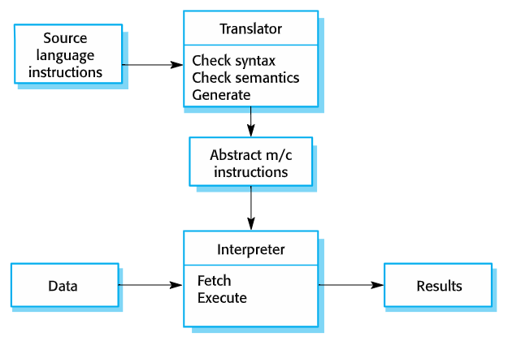 |
|:--:|
| The architecture of A Language Processing System |

### Compiler Architecture

Components:

- A lexical analyzer: takes input language tokens and converts them to an internal form
- A symbol table: holds information about the names of entities (variables, class names, object names, etc.) used in the text that is being translated
- A syntax analyzer: checks the syntax of the language being translated
- A syntax tree: an internal structure representing the program being compiled
- A semantic analyzer: uses information from the syntax tree and the symbol table to check the semantic correctness of the input language text
- A code generator: ‘walks’ the syntax tree and generates abstract machine code

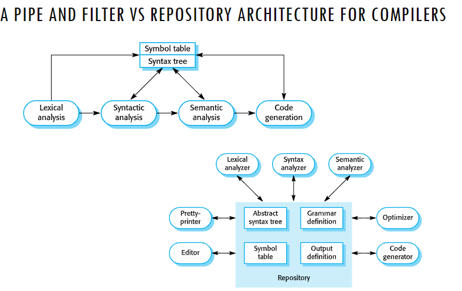

# Chapter 8: Software Implementation

## Implementation Meaning

### Golden Rule

- Requirements to satisfy **Customers**
- Design again **requirements** only
- Implement again **design** only
- Test again **design** and **requirements**

### Code quality

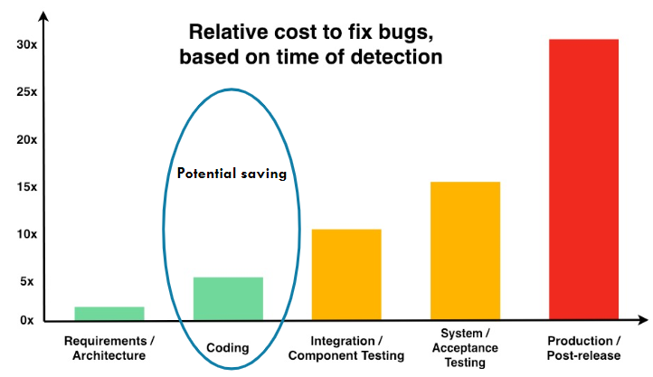

### Implement Code

1. Plan the structure and residual design for your code
2. Self-inspect your design and/or structure
3. Type your code
4. Self-inspect your code
5. Compile your code
6. Test your code

## General Principles in Programming Practice

1. Try to re-use first
2. Enforce intentions
   1. If your code is intended to be used in particular ways only, write it so that the code cannot be used in any other way
   2. If a member is not intended to be used by other functions, enforce this by making it private or protected etc
   3. Use qualifiers such as final and abstract etc. to enforce intentions

### “THINK GLOBALLY, PROGRAM LOCALLY”

Make all members as local as possible, as invisible as possible (attributes **private**: access them through more public accessor functions if required; Making attributes protected gives objects of subclasses access to members of their base classes -- not usually what you want)

### Exception Handling

- Catch only those exceptions that you **know how** to handle
- Be **reasonable** about **exceptions** callers must handle
- Don’t substitute the use of exceptions for issue that should be the subject of **testing**

### Naming Conventions

- Use concatenated words (cylinderLength)
- Begin class names with capitals
- Variable names begin lower case
- Constants with capitals (as in MAX_N or use static final)
- Data members of classes with an underscore (as in _timeOfDay)
- Use get..., set...., and is... for accessor methods
- Additional getters and setters of collections
- And/or distinguish between instance variables, local variables and parameters

### Documenting Methods

- what the method **does**
- **why** it does so
- what **parameters** it must be passed (use @param tag)
- **exceptions** it throws (use @exception tag)
- reason for choice of **visibility**
- **known** bugs
- **test** description, describing whether the method has been tested, and the **location** of its test script
- **history** of changes if you are not using a sub-version system
- **example** of how the method works
- pre- and post-**conditions**
- special documentation on threaded and **synchronized** methods

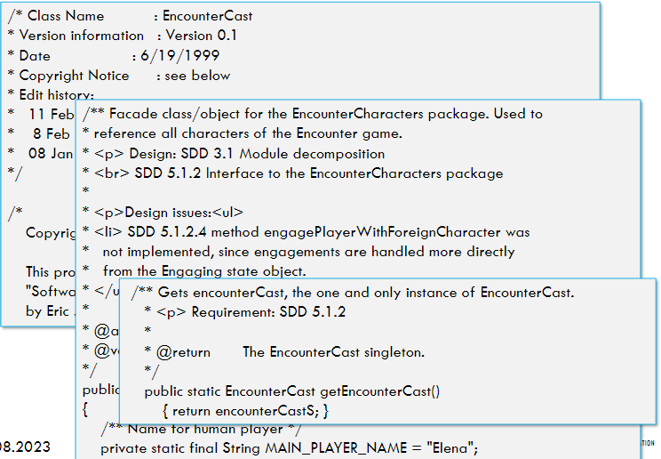

#### Documenting Attributes

- Description -- what it's used for
- All applicable invariants (quantitative facts about the attribute - such as "1 < _age < 130")

#### Constants

- Before designating a final variable, be sure that it is, indeed, final.  You’re going to want to change "final" quantities in most cases.  Consider using method instead.

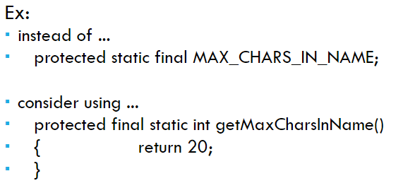

#### Initializing Attributes

- Attributes should be always be initialized, think of *private float _balance = 0*;
- Attribute may be an object of another class, as in *private Customer _customer*
- Traditionally done using the constructor, as in *private Customer _customer = new Customer( "Edward", "Jones" )*
- Problem is **maintainability**.  When new attributes added to Customer, all have to be updated. Also accessing persistent storage unnecessarily.

## Code Smells

- Code smells are any violation of fundamental design principles that decrease the overall quality of the code.
- Not bugs or errors
- Can certainly add to the chance of bugs and failures down the line

### Code refractoring goals and properties

- Change the internal structure without changing external behavior
- Eliminate code smells for readability, consistency, maintainability
- Properties: Preserve correctness, One step at a time, Frequent testing

#### Bloaters

#### Object-orientation Abusers

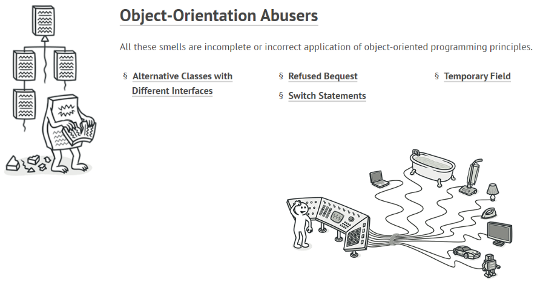

#### Change preventers

#### Dispensables

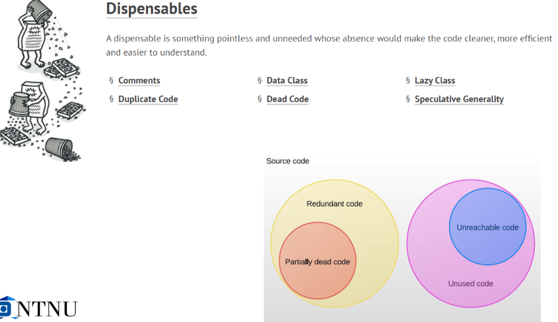

#### Couplers

### Code Refactoring Steps

- Designing solid tests for the section to be refactored
- Reviewing the code to identify bad smells of code
- Introducing refactoring and running tests (One step at a time)

#### Remove duplicated code - pull up method - Dry

- You have methods with identical results on subclasses

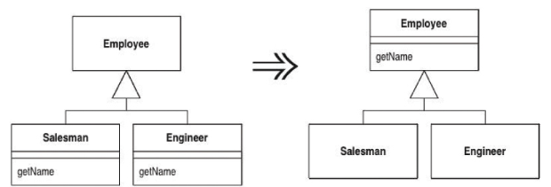

- You want to replace an algorithm with one that is clearer

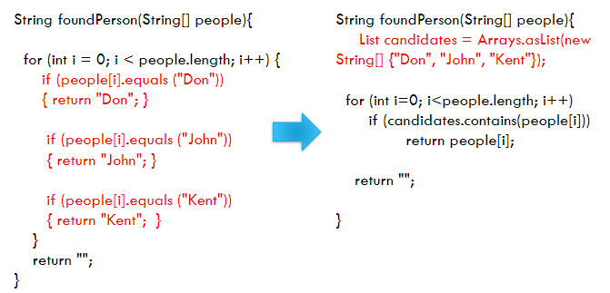

#### Reduce size - shorten method/class

- Long method (extract method)
- Large class (extract class, subclass, interface)
- If you have to spend effort looking at a fragment of code and figure out what it is doing, then you should extract it into a function/method and name it after “what.”

- Long parameter list (introduce parameter object)

#### Divergent Change

- Code smell
  - One module is often changed in different ways for **different reasons**.
  - Classes have more than distinct responsibilities that it **has more than one reason** to change
  - Violation of **single responsibility design** principle
- Refractoring: You identify **everything that changes for a particular cause** and put them all together

#### Increase Cohesion

- Feature envy: A function in one module spends more time communicating with functions or data inside another module than it does within its own module. Move function to give it a dream home

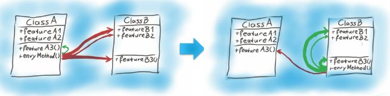

- Data clumps: Bunches of data often hang around together, Consolidate the data together, e.g., Introduce Parameter Object or Preserve Whole Object

#### Primitive Obsession

- Primitive fields are **basic built-in building blocks** of a language, e.g., int, string, or constants
- Primitive Obsession is when the code **relies too much on primitives** and when uses primitive types to represent an object in a domain

## Inspection

- Visual examination of software product
- Identify software anomalies: Errors, Code smells, Deviations from specifications, Deviations from standards(E.g., Java code conventions)

Why need inspection

- Many software artifacts cannot be verified by running tests, e.g. (Requirement specification, Design, Pseudocode, User manual)
- Inspection reduces defect rates
- Inspection complements testing
- Inspection identifies code smells
- Inspection provides additional benefits

### Inspection Finds Types of Defects different from Testing

### Inspection reduces Defect Rates

### Testing vs. Inspection

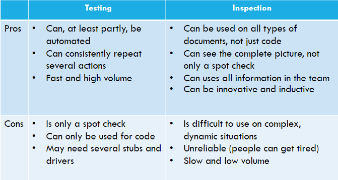

#### Code Review at Google

- “All code that gets submitted needs to be reviewed by at least one other person, and either the code writer or the reviewer needs to have readability in that language”
- “Most people use Mondrian to do code reviews, and obviously, we spend a good chunk of our time reviewing code”

## Inspect Code

### Class overall

C1.  Is its (the class’) name appropriate? 
C2.  Could it be abstract (to be used only as a base)?
C3.  Does its header describe its purpose?
C4.  Does its header reference the requirements and/or design element to which it corresponds? 
C5.  Does it state the package to which it belongs?
C6.  Is it as private as it can be?
C7.  Should it be final (Java)
C8.  Have the documentation standards been applied?

### Attributes

A1.  Is it (the attribute) necessary?
A2.  Could it be static?
A3.  Should it be final?
A4.  Are the naming conventions properly applied?
A5.  Is it as private as possible?
A6.  Are the attributes as independent as possible?
A7.  Is there a comprehensive initialization strategy?

### Constructors

CO1.  Is it (the constructor) necessary?
CO2.  Does it leverage existing constructors?
CO3.  Does it initialize of all the attributes?
CO4.  Is it as private as possible?
CO5.  Does it execute the inherited constructor(s) where necessary?

### Method Headers

MH1.  Is the method appropriately named?
MH2.  Is it as private as possible?
MH3.  Could it be static?
MH4.  Should it be final?
MH5.  Does the header describe method’s purpose?
MH6.  Does the method header reference the requirements and/or design section that it satisfies? 
MH7.  Does it state all necessary invariants?
MH8.  Does it state all pre-conditions?
MH9.  Does it state all post-conditions?
MH10.Does it apply documentation standards?
MH11.Are the parameter types restricted?

### Method Bodies

MB1.   Is the algorithm consistent with the detailed design pseudocode and/or flowchart?   
MB2.   Does the code assume no more than the stated preconditions?
MB3.   Does the code produce every one of the postconditions?
MB4.   Does the code respect the required invariant?
MB5.   Does every loop terminate? 
MB6.   Are required notational standards observed? 
MB7.   Has every line been thoroughly checked?
MB8.   Are all braces balanced? 
MB9.   Are illegal parameters considered?
MB10. Does the code return the correct type?  
MB11. Is the code thoroughly commented?

# Chapter 9: Software Quality & Quality Assurance

## Definitions

- (ISO) defines **quality** as the totality of characteristics of an entity that bear on its ability to satisfy stated or implied needs (ISO8042:1994) or the degree to which a set of inherent characteristics fulfils requirements. (ISO9000:2000)
- **Conformance to requirements** means the project s processes and products meet written specifications.
- **Fitness for use** means a product can be used as it was intended.
- Quality aspects:
  -  product: delivered to the customer
  - process: produces the software product
  - resources: (both the product and the process require resources)

### Process Quality vs. Product Quality

- Quality can mean the difference between excellence and disaster
- “The black boxes attest to that there are no structural defects [with the aircraft], but we have a serious quality problem in the final assembly.”
- “...either a weakness in the test procedure of planes before they fly, or a problem that results from the implementation of these procedures.”

#### Software Quality Model

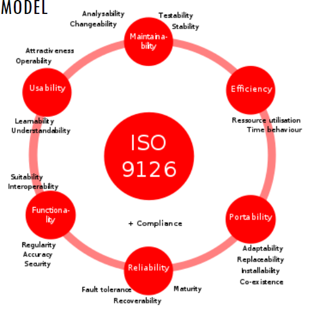

## Software Testing

### Program Testing

- Testing is intended to show that a program does what it is **intended** to do and to discover program **defects** before it is put into use.
- Can reveal the **presence** of errors **NOT** their absence.
- Testing is part of a more general **verification** and **validation** process, which also includes **static** validation techniques.

#### Program Testing goals

- To demonstrate to the developer and the customer that the software **meets its requirements** - validation testing
- To discover situations in which the behavior of the software is **incorrect**, undesirable or does not conform to its **specification** - defect testing
- The product of Testing is Confidence

#### Psychology of Testing

- A program is its programmer’s baby!
  - Trying to find errors in one’s own program is like trying to find defects 
in one’s own baby.
  - It is best to have someone other than the programmer doing the 
testing.
- Tester must be highly skilled, experienced professional.
- It helps if he or she possesses a diabolical mind.
- Testing achievements depend a lot on what are the goals.
- Myers says (79): If your goal is to **show absence of errors**, you will not discover many. If you are trying to **show the program correct**, your subconscious will manufacture safe test cases. If your goal is to **show presence of errors**, you will discover large percentage of them.
- Testing is the process of executing a program with the intention of finding errors

#### An Input-Output Model of Program Testing

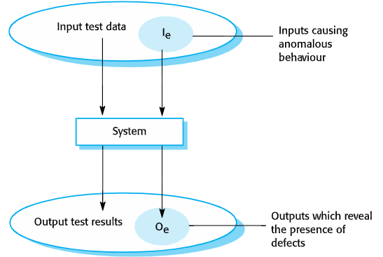

#### A model of the Software Testing Process

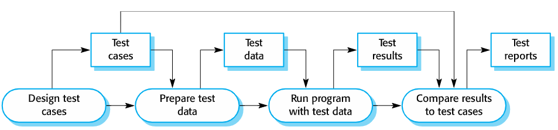

### Stage of Testing

- Development testing: the system is tested during development to discover bugs and defects. 
-Release testing: a separate testing team test a complete version of the system before it 
is released to users. 
- User testing: users or potential users of a system test the system in their own 
environment.

#### Development Testing

- Carried out by the team developing the system
- Unit testing: for individual program units or object classes, focus on testing the functionality of objects or methods.
- Component testing: several individual units are integrated to create composite components, focus on testing component interfaces.
- System testing: some or all of the components in a system are integrated and the system is tested as a whole, focus on testing component interactions.

#### Unit Testing

- Unit testing is the process of testing individual components in 
isolation.
- It is a defect testing process.
- Units may be:
  - Individual functions or methods within an object 
  - Object classes with several attributes and methods 
  - Composite components with defined interfaces used to access their functionality.

##### Unit Testing: black/white-box test

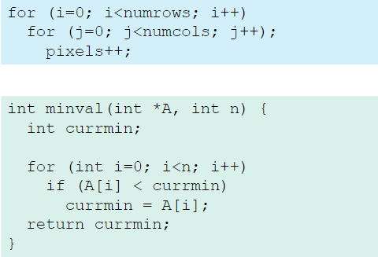

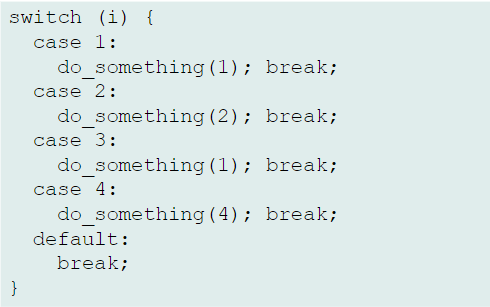

##### Equivalence Partitioning & Boundary Value Analysis 

##### White box testing

##### Regression Testing

- Test the system to check that changes have not 
‘broken’ previously working code.
- Better with automated testing
- All tests are re-run every time a change is made to the program.
- Tests must run ‘successfully’ before the change is committed.

##### Automated Testing

- Whenever possible, unit testing should be automated
- Use of a test automation framework (such as JUnit)

#### System Testing

- System testing during development = to create a version of the system and then testing the integrated system.
- Focus on testing the interactions between components. System testing checks that components are compatible, interact correctly and transfer the right data at the right time across their interfaces. 
- And tests the emergent behaviour of a system.

##### Functionality Tests

##### GUI Testing

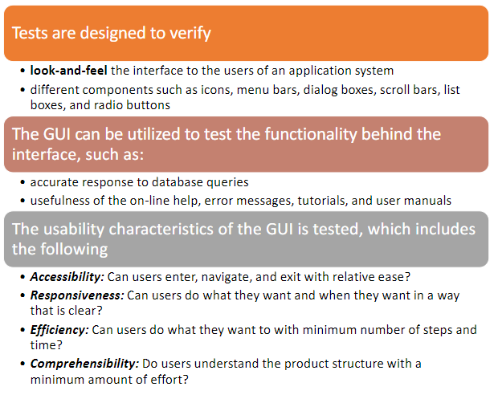

##### Interoperability Tests

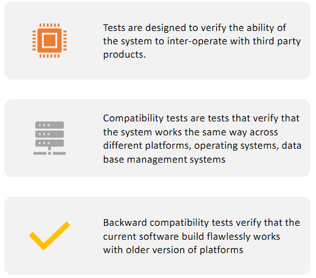

##### Robustness Tests

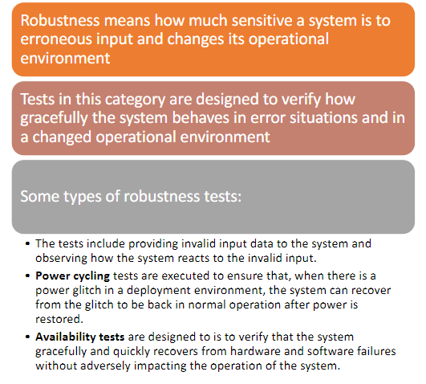

##### Performance Tests

##### Scalability Tests

##### Stress Tests

##### Load and Stability Tests

##### Security Testing

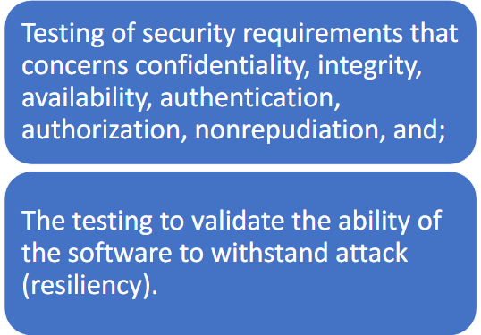

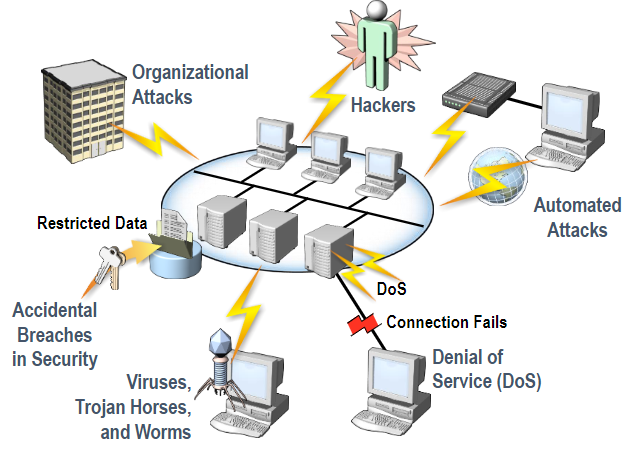

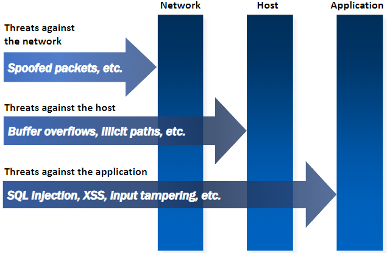

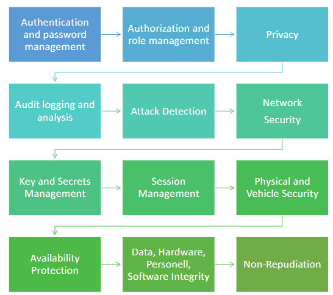

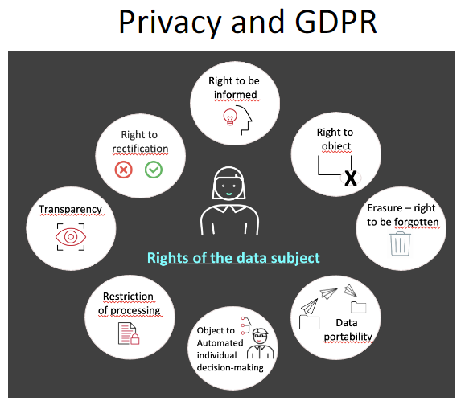

##### Regulatory Tests

##### Safety Assurance

##### Regression Tests

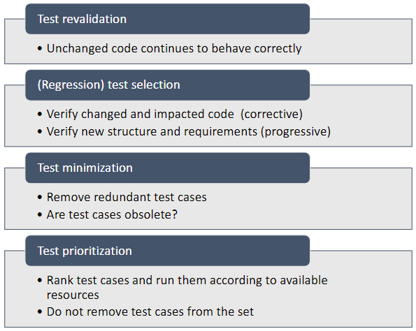

##### Acceptance Testing

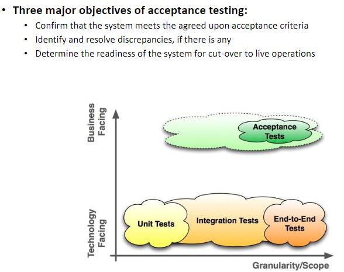

## Test Planning

### Use-case Testing - Test case

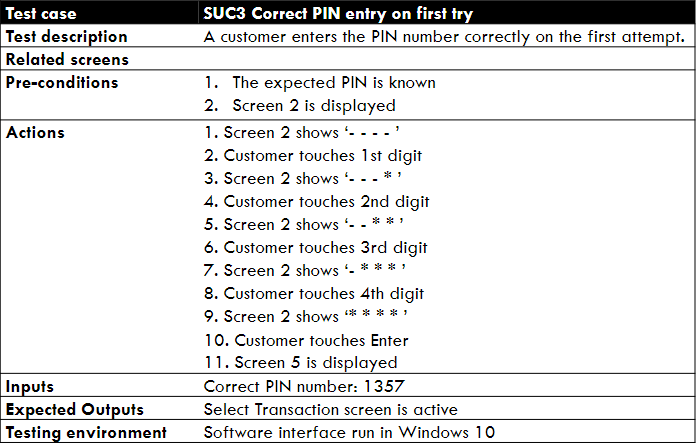

### Use-case Testing

- The use-cases developed to identify system interactions can be used as a basis for system testing.
- Each use case usually involves several system components so testing the use case forces these interactions to occur. The sequence diagrams associated with the use case documents the components and interactions that are being tested.

#### Test Plan

- Testing requires meticulous planning on an operational level and on a strategic 
level
- The test manager needs to transpose such generic guidelines to create a 
concrete testing strategy for the project at hand 
- Test plan should state:
  - Test object: which components, modules, neighboring systems, and interfaces (will) make up 
the system to be tested
  - test objectives: specific testing objectives and the criteria you are testing against for each 
test object and the entire system
  - Customize the testing process
  - testing methods and techniques: overall testing approach and the testing techniques
  - required infrastructure
  - Success/ failure criteria: test metrics and threshold

##### A case - ATM Terminal Software Testing

- A simple version of ATM machine
- Insert your card, type PIN code and withdraw cash from the machine

- List of designed screens

- State diagram from the Idle state to the Closed ATM session

##### Test plan - Example

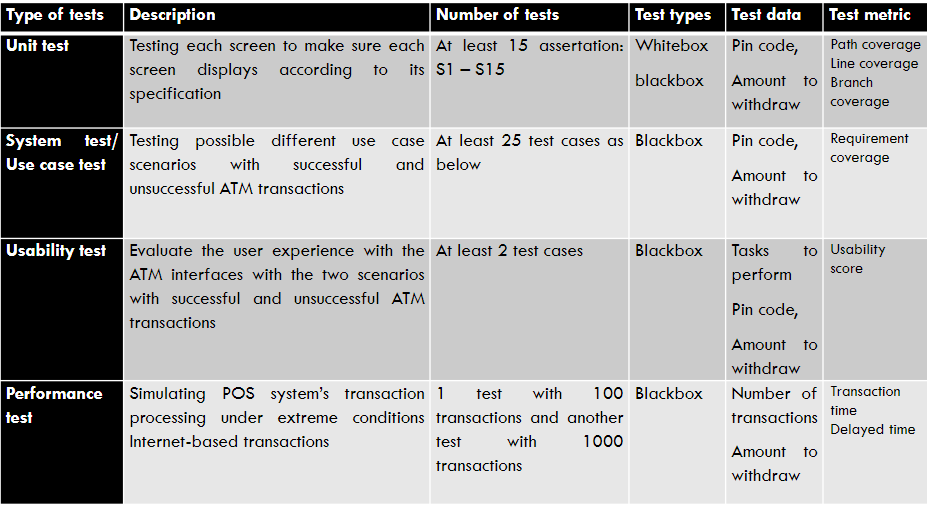

### User Acceptance Test (UAT)

- acceptance testing is a test conducted to determine if the requirements of a specification or contract are met
- It can look like a system test ... with customer involvement
- It is blackbox testing
- It may involve performance test, stress test, usability test, etc
- Testers should be given real-life scenarios such as the three most common or difficult tasks that the users they represent will undertake

#### Stages in the Acceptance Testing Process

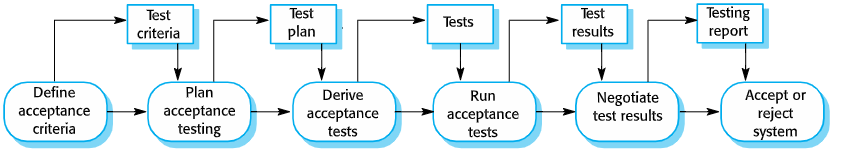

- Define acceptance criteria
- Plan acceptance testing
- Derive acceptance tests
- Run acceptance tests
- Negotiate test results
- Reject/accept system

# Chapter 10: Agile Software Development

## Rapid Software Development

Rapid development and delivery is now often the most important requirement for software systems

- Businesses operate in a fast-changing requirement 
- => practically impossible to have stable software requirements
- Software has to evolve quickly to reflect changing business needs.
- Plan-driven development (waterfall, incremental dev.) is essential for some types of system but does not meet these business needs.

## Agile Development

- aim to radically reduce the delivery time for working software systems
- Program specification, design and implementation are inter-leaved
  - The system = a series of versions / increments 
  - Stakeholders involved in version specification and evaluation
  - Frequent delivery of new versions for evaluation
- Minimal documentation – focus on working code - Extensive tool support (e.g. automated testing tools) used to support development.

### Plan-driven and Agile Development

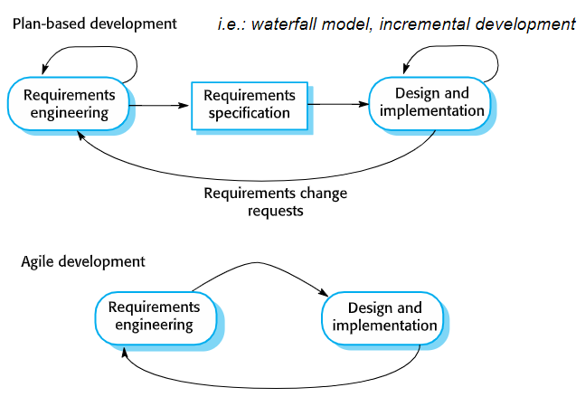

## Agile Methods

### The Agile Manifesto

#### Value 1: Individuals and Interactions over processes and tools

- Strong players: a must, but can fail if don’t work together.
- **Strong player**: not necessarily an ‘ace;’  work well with others! 
–Communication and **interacting** is more important than raw talent.
- **‘Right’ tools** are vital to smooth functioning of a team.
- **Start small**.  Find a free tool and use until you can demo you’ve outgrown it.  Don’t assume bigger is better.  Start with white board;  flat files before going to a huge database.
- Building a **team** more important than building **environment**.
  - Some managers build the environment and expect the team to fall together.  
  - Doesn’t work.  
  - Let the team build the environment on the **basis of need**.

#### Value 2: Working Software over comprehensive documentation

- **Code** – not ideal medium for communicating rationale and system structure.  
  - Team needs to produce human readable documents describing system and design decision rationale.
- **Too much documentation is worse than too little**.
  - Take time;  more to keep in sync with code;  Not kept in sync? it is a lie and misleading.
- **Short rationale and structure document**.
  - Keep this in sync;  Only highest level structure in system kept. 
  - **Fatal flaw**:  Pursue documentation instead of software:
- **Rule**:  Produce no document unless need is immediate and significant.

#### Value 3: Customer Collaboration over Contract Negotiation

- **Not possible** to describe software requirements up front and leave someone else to develop it within cost and on time.
- Customers **cannot** just cite needs and go away
- Successful projects require **customer feedback on a regular and frequent basis** – and not dependent upon a contract or SOW.
- Best contracts are NOT those specifying requirements, schedule and cost - Become meaningless shortly.
- Far better are contracts that govern the way the development team and customer will work together. 
- Key is intense collaboration with customer and a contract that governed collaboration rather than details of scope and schedule
  - Details ideally not specified in contract.  
  - Rather contracts could pay when a block (deliverable) passed customer’s acceptance tests. 
  - With frequent deliverables and feedback, acceptance tests never an issue.

#### Value 4: Responding to change over following a plan

- Our plans and ability to respond to changes is critical!
- Course of a project cannot be predicted far into future.
  - Too many variables;  not many good ways at estimating cost  
  - As developers gain knowledge of the system and as customer gains knowledge 
about their needs, some tasks will become unnecessary.
- Better planning strategy: – make detailed plans for the next few weeks, very rough plans for the next few months, and extremely crude plans beyond that.
- Need to know what we will be working on the next few weeks;  roughly for the next few months;  a vague idea what system will do after a year.
- Only invest in a detailed plan for immediate tasks;  once plan is made, difficult to change due to momentum and commitment - The lower resolution parts of the plan can be changed with relative ease.28

## SCRUM

### Used for

### How Scrum works

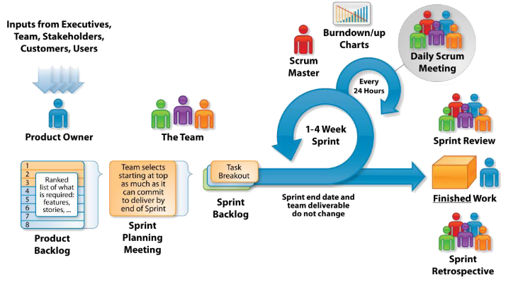

### Scrum Framework

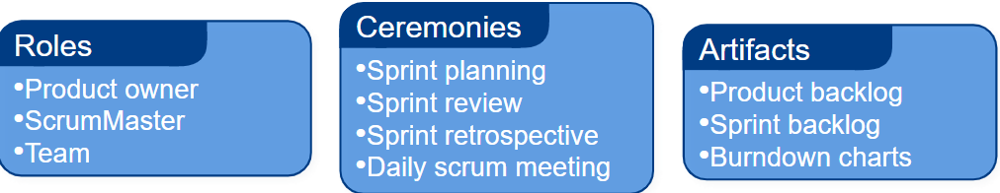

### Scrum Role

#### Product Owner

- Define the features of the product
- Decide on release date and content
- Be responsible for the profitability of the product (ROI)
- Prioritize features according to market value 
- Adjust features and priority every iteration, as needed
- Accept or reject work results

#### Scrum Master

- Represents management to the project
- Responsible for enacting Scrum values and practices
- Removes impediments 
- Ensure that the team is fully functional and productive
- Enable close cooperation across all roles and functions
- Shield the team from external interferences

#### Team

- Typically 5-9 people
- Cross-functional:
- Programmers, testers, user experience designers, etc.
- Members should be full-time
  - May be exceptions (e.g., database administrator)
- Teams are self-organizing
  - Ideally, no titles but rarely a possibility
- Membership should change only between sprints

### Scrum Ceremonies

#### Sprint planning

- Decide how to achieve sprint goal (design)
- Team selects items from the product backlog they can commit to completing
- Create sprint backlog (tasks) from product backlog items (user stories / features)
- Estimate sprint backlog in hours. Tasks is estimated (1-16 hours)
- Collaboratively, not done alone by the ScrumMaster

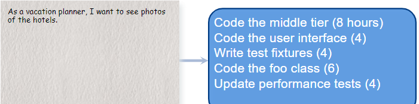

##### Daily Scrum - Bi/Weekly Scrum

- Daily, 15-minutes, stand-up
- Not for problem solving
- Moderated by a Scrum Master
- Three questions:
  - What did you do yesterday?
  - What will you do today?
  - Is anything in your way?

#### Sprint review

- Team presents what it accomplished during the sprint
- Typically takes the form of a demo of new features or underlying architecture
- Informal
  - 2-hour prep time rule
  - No slides
- Whole team participates
- Invite the world

#### Sprint retrospective

- Periodically take a look at what is and is not working
- Typically 15–30 minutes
- Done after every sprint
- Whole team participates
- Moderated by a Scrum Master
- Each team member is asked to identify specific things that the team should:
  - Start doing
  - Stop doing
  - Continue doing

#### Daily scrum meeting

### Scrum Artifacts

- Product backlog
- Sprint backlog
- Burndown charts

#### Product Backlog vs. Sprint Backlog

#### User stories

- An informal, natural language description of one or more 
features of a software system
- Written from the perspective of an end user
- A common pattern:
  - As a *role* I can/ want *capability*, so that *receive benefit*

##### User Stories in Sprint Backlog vs. Product Backlog

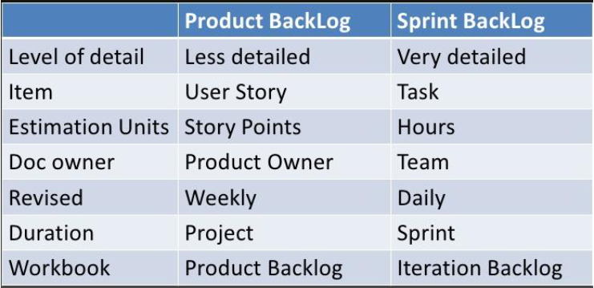

### Effort Estimation

- In the beginning of the Sprint, we should be able to tell how long/ how costly it will take to accomplish User Story ABC 
  - “I think it will take me five days full-time to finish the User Story ABC”
  - “This week I have a midterm exam, so I take me all together seven days...”
  - “This User Story ABC might need 3000 Line of Codes...”
  - “This User Story ABC will have 3 user interfaces...”
  - “ I would give it 5 out of 10 points in term of efforts needed”
- Many different approaches for estimation
- No estimation is perfect
- What is important is to have the consistent understanding about the effort/ complexity of the task/ the user story throughout the WHOLE team

#### Planning Poker

- For each user story, a team member can give a number 0, 1, 2, 3, 5, 8, 13, and 21 (A story estimated as a 2 should be about one fourth as difficult as a story estimated as an 8)
  - 0 is the most simple/ easiest
  - 21 is the most difficult/ most effort needed
- A moderator ask each member:
  - Read aloud the number
- The team members with the lowest and highest estimates explain why they chose 
their scores
- Discuss until the team reach consensus on one number

#### Burndown Chart

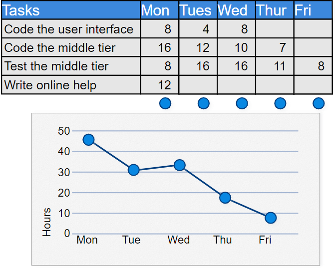

### Scrum Benefits

- The product is **broken down** into a set of manageable and understandable chunks.
- **Unstable** requirements do not hold up progress.
- The whole team have **visibility** of everything and consequently team communication is improved.
- Customers see **on-time delivery** of increments and gain feedback on how the product works.
- Trust between customers and developers is established and a positive culture is created in which everyone expects the project to succeed.

## Extreme Programming

Extreme Programming (XP) takes an ‘extreme’ approach to iterative 
development

- New versions may be built several times per day
- Increments are delivered to customers every 2 weeks
- All tests must be run for every build and the build is only accepted if tests run 
successfully.

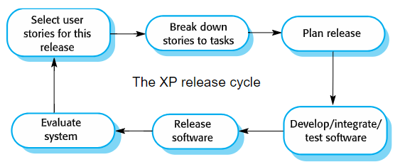

# Chapter 11: Continuous Integration and Delivery (CI/CD)

## The Challenge: Complexity and Size

- As the project grows, complexity grows:
  - Physical code size
  - Dependencies
  - Number of developers
  - Package versions
- Examples of well-known open source projects
- Some notably large codebases include:
  - Google: monolithic, 1 billion files, 9 million source code files, 2 billion lines of source code, 35 million commits in total, 86 TB total size (January 2015)
  - Facebook: monolithic, 8 GB (repo 54 GB including history, 2014),[6] hundreds of thousands of files (2014)
  - Linux kernel: distributed, over 15 million lines of code (as of 2013 and kernel version 3.10)

- How do we handle increasing code-base sizes?
- How do we handle an increasing number of 
developers?
- How can developers interact with each other?
- How do we build across multiple platforms?
- How do we build multiple versions?
- How can we make sure we don’t break things!

## Integration

- Software teams often have multiple developers working on the same codebase at the same time(independently):
  - E.g. Developer A works on feature 1 while developer B works on feature 2.
  - E.g. Developer A works on class 123.java while developer B works on 
class 456.java
- Once they have finished, they needs to integrate their work into the main codebase.

### Terminology

- Integration
- Repository
- Pull vs. Push
- Software Version

Mainline integration:Developers integrate their work by pulling from mainline, merging, and - if healthy - pushing back into mainline

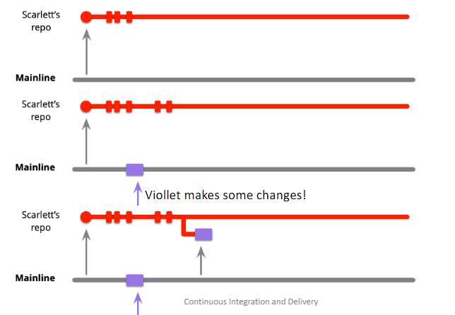

Mainline integration:Developers integrate their work by pulling from mainline, merging, and - if healthy - pushing back into mainline

### Integration Frequency

- Elite development teams integrate notably more often than low performers
- Low-Frequency Integration

- Elite development teams integrate notably more often than low 
performers
- High-Frequency Integration

### Continous Integration

#### What is Continous Integration

- Continuous integration (CI) is a software development practice where developers in a team integrate their work frequently
- Developers usually integrates several times a day.
- Each integration is verified by anautomated build: compile the code and also run automated tests?
- Question: Why are automated tests run?

#### Why is Continous Integration

#### how is Continous Integration

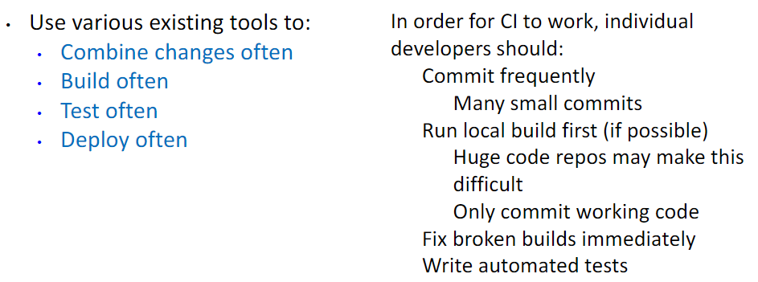

#### Continous Integration Model

- Version control software
- Dependency management
- Automated testing software
- Continuous integration framework
- Infrastructure management
- Build automation

#### Continous Integration Tools

- Code repositories
  - Github, Bitbucket, Mercurial, BitKeeper, Bzr, CVS, 
Darcs, Gerrit, Monotone, P4, SVN ...
- Test frameworks
  - CppUnit, Valgrind, JUnit, Unittest, TestNg ...
- Continuous Integration
  - Bamboo, Buildbot, CruiseControl, Jenkins, Gitlab CI 

#### Setting up a Continous Integration (CI) Pipeline

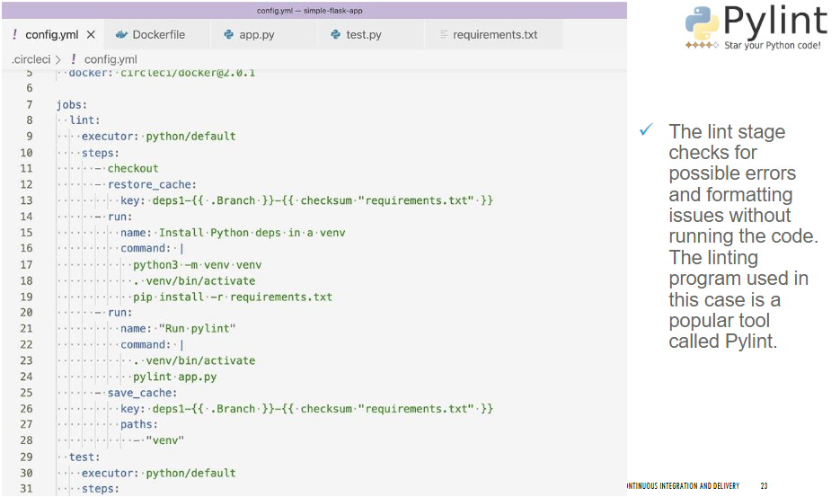

## Automated Testing -

- Automated testing is the application of software tools to automate a human-driven manual process of reviewing and validating a software product
-Different levels:
  - Unit test
  - Integration test: mocking these 3rd party dependencies and asserting the code interfacing with them behaves as expected
  - Performance test: i.e. speed and responsiveness

## Regression Testing -

- Re-running functional and non-functional tests to ensure that previously developed and tested software still performs after a change
- Three types

### Build step

### Docker

- an open platform for developing, shipping, and running applications
- separate your applications from your infrastructure
- significantly reduce the delay between writing code and running it in production
- container

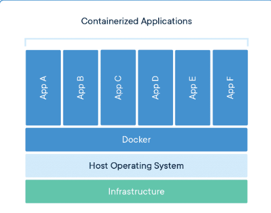

#### Deploy Step

### Continuous Delivery

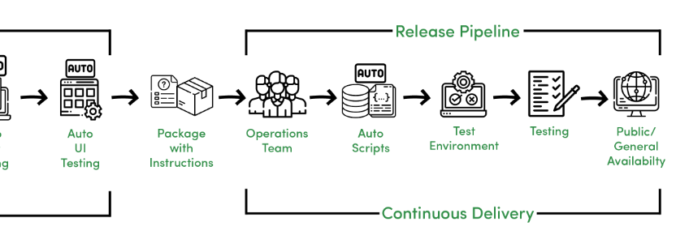

- Teams produce software in short cycles, ensuring that the software can be reliably released at any time and, when releasing the software, without doing so manually.
- Continuous delivery is an extension of continuous integration since it automatically deploys all code changes to a testing and/or production environment after the build stage.

### Common Pitfall of CI/CD

- Wrong processes may be automated first
- Confusion between Continuous Deployment and Continuous Delivery
- Inadequate coordination between continuous integration and continuous delivery
- Meaningful dashboards and metrics may be absent
- Requires new skillset
- Maintenance is not easy

## DevOps

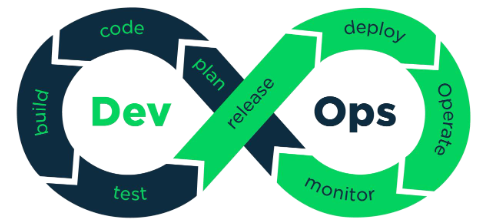

- a set of practices that combines software development (Dev) and IT operations (Ops)
- a set of practices that combines software development (Dev) and IT operations (Ops)
- a set of practices that combines software development (Dev) and IT operations (Ops)
- Breaking the Silos: Dev and Ops 
- aims to shorten the systems development life cycle and provide continuous delivery with high software quality

### Devs and Ops working together

- Create feedback loops between inventors and mechanics 
- Expose real-time metrics from ops enabling dev to learn from the system running under real world conditions
- Expose real-time metrics from dev enabling ops to anticipate production needs and provide early input
- Cross-functional teams collaborate to deliver whole working systems including all infrastructure, software code, and configurations

### DevOps: The Three stage Conversation

People - Process - Products

### List of DevOps Practices

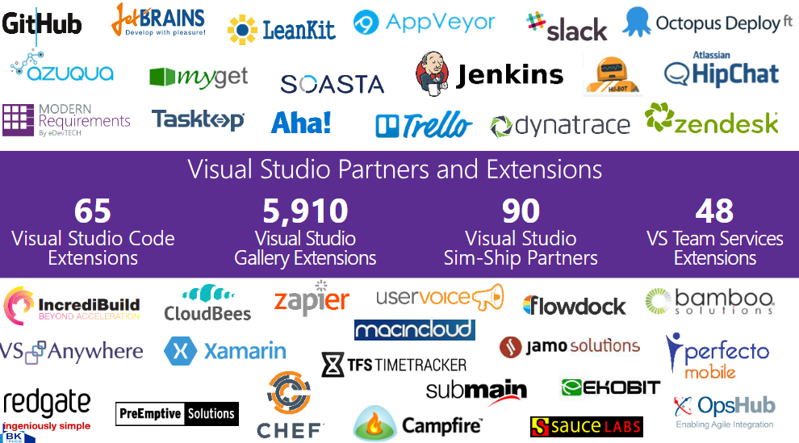

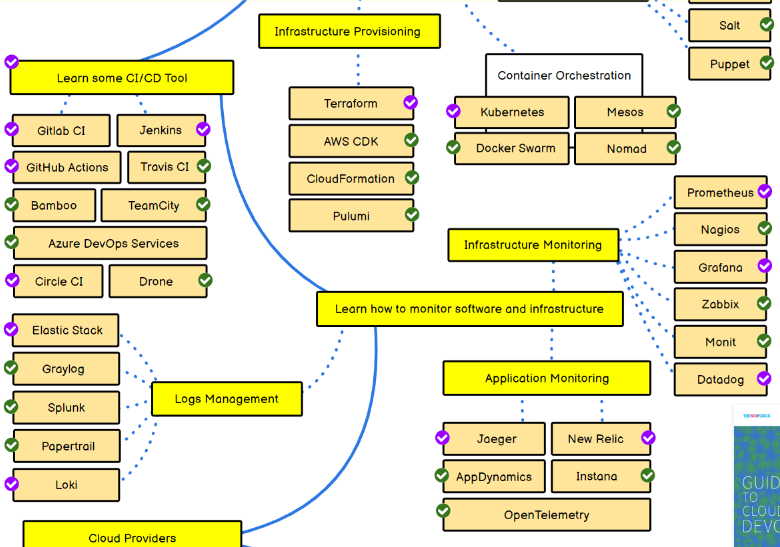

# Chapter 12: Advanced Topics

## Miscs

- 75% of attacks today happen at the Application Layer (Gartner).  
- Many “easy hacking recipes” published on web. 
- Security holes in the web application layer can make a perfectly patched and firewalled server completely vulnerable.
- The cost and reputation savings of avoiding a security breach are “priceless”

## Security Properties

- Confidentiality: Information about system or its users cannot be learned by an attacker
- Integrity: The system continues to operate properly, only reaching states that would occur if there were no attacker
- Availability: Actions by an attacker do not prevent users from having access to use of the system

- Security is about
  - Honest user (e.g., Alice, Bob, ...)
  - Dishonest Attacker
- How the Attacker 
  - Disrupts honest user’s use of the system  (Integrity, Availability)
  - Learns information intended for Alice only (Confidentiality)

- Confidentiality: Attacker does not learn Alice’s secrets
- Integrity: Attacker does not undetectably corrupt system’s function for Alice
- Availability: Attacker does not keep system from being useful to Alice

### OWASP Top Ten list

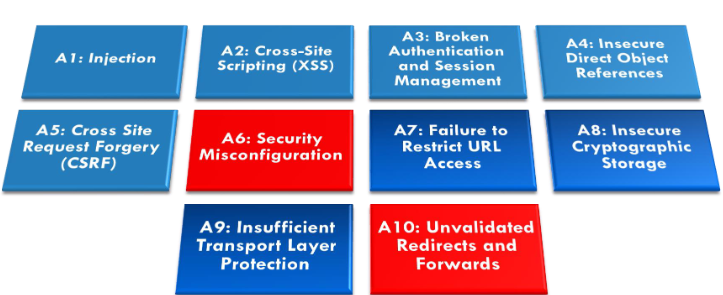

### Cross-site Scripting (XSS) Attacks

- inject client-side scripts into web pages viewed by other users
- A hacker was able to insert JavaScript code into the Obama community blog section
  - The JavaScript would redirect the users to the Hillary Clinton website
- Websites from FBI.gov, CNN.com, Time.com, Ebay, Yahoo, Apple computer, Microsoft, Zdnet, Wired, and Newsbytes have all had XSS bugs

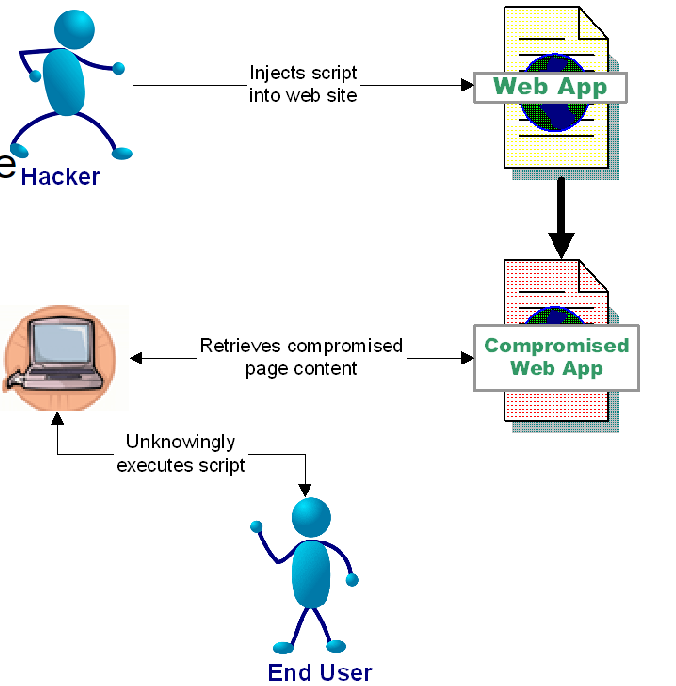

### SQL Injection Attacks

- “SQL injection is a security vulnerability that occurs in the database layer of an application. Its source is the incorrect escaping of dynamically-generated string literals embedded in SQL statements. “ (Wikipedia)

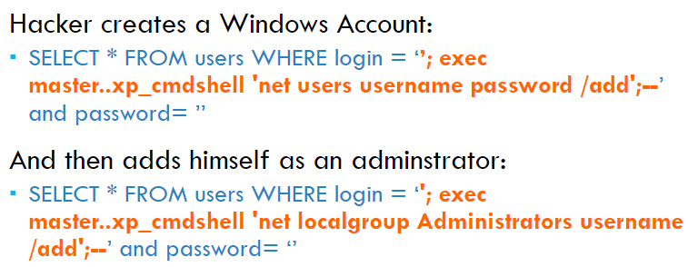

### Insecure Direct Object Reference

- “A direct object reference occurs when a developer exposes areference to an internal implementation object, such as a file,directory, database record, or key, as a URL or form parameter. Attackers can manipulate those references to access other objects without authorization.”
- Fancy term for parameter tampering
- Involves modifying parameters to access unauthorized materials
- E.g. /BankAccount.jsp?acct_nmbr=123
  - The hacker modifies the parameter to view another users account

### Malicious File Execution

- “Code vulnerable to remote file inclusion (RFI) allows attackers to include hostile code and data, resulting in devastating attacks, such as total server compromise. Malicious file execution attacks affect PHP, XML and any framework which accepts filenames or files fromusers.”
- Happens when code is executed on the server from a non-trusted source
  - All web applications are vulnerable to malicious file execution if they accept filenames or files from the user.
- Classic example: PHP is particularly vulnerable
- Hacker visits a website that allows uploads
- Hacker uploads a malicious code
- Hacker learns directory structure and sends the path as a parameter
- PHP code is executed on the server
- include $_REQUEST[‘filename’];

- The Common Weakness Enumeration (CWE) is a category system for software weaknesses and vulnerabilities. It is sustained by a community project with the goals of understanding flaws in software and creating automated tools that can be used to identify, fix, and prevent those flaws.

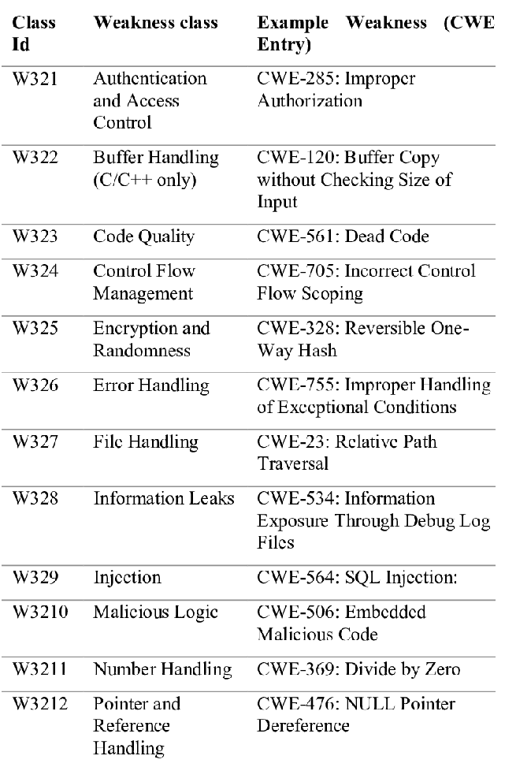

## Vulnerability Assessment

- Assess and secure all parts individually
- The idea is to force an attacker to penetrate several
defence layers
- As a general rule, data stored in databases are considered as "untrusted"

- Static analysis
  - Automated methods to find errors or check their absence
    - Consider all possible inputs (in summary form)
    - Find bugs and vulnerabilities
    - Can prove absence of bugs, in some cases
- Dynamic analysis
  - Run instrumented code to find problems
    - Need to choose sample test input
    - Can find vulnerabilities but cannot prove their absence

## Penetration Testing (PenTest)

- A penetration test is a method of evaluating the security of a computer system or network by simulating an attack from a malicious source, known as a Black Hat Hacker, or Cracker.

### Steps

- Analysis and Information Gathering
  - To discover as much information about a target (individual or organization) as possible without actually making network contact with said target.
  - Methods:
    - Organization info discovery via WHOIS
    - Google search
    - Website browsing
- Network Enumeration and Scanning
  - To discover existing networks owned by a target as well as live hosts
and services running on those hosts.
  - Methods
    - Scanning programs that identify live hosts, open ports, services, and other info (Nmap, autoscan)
    - DNS Querying
    - Route analysis (traceroute)
- Vulnerability Testing and Exploitation
  - To check hosts for known vulnerabilities and to see if they are exploitable, as well as to assess the potential severity of said vulnerabilities.
  - Methods:
    - Remote vulnerability scanning (Nessus, OpenVAS)
    - Active exploitation testing
    - Login checking and bruteforcing
    - Vulnerability exploitation (Metasploit, Core Impact)
    - 0day and exploit discovery (Fuzzing, program analysis)
    - Post exploitation techniques to assess severity (permission levels, backdoors, rootkits, etc)
- Reporting
