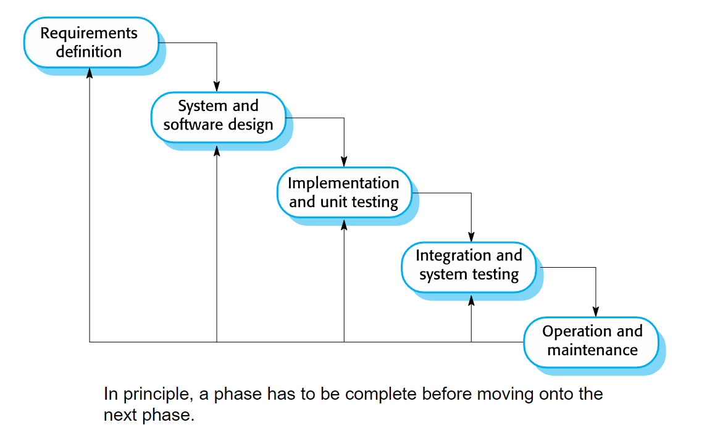
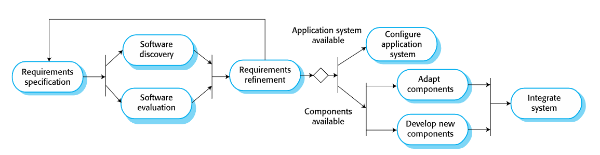
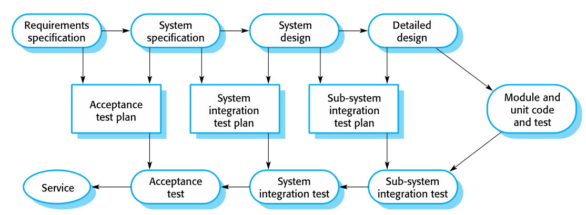

# Chapter 2: Software Process

Software Engineering is a branch of systems engineering concerned with the
development of large and complex software intensive systems. It focuses on:

- the real-world goals for, services provided by, and constraints on such systems
- the precise specification and implementations
- the activities required in order to develop an assurance that the specifications and
real world-world goals have been met
- the evolution of these systems over time, and across systems families
- It is also concerned with the processes, methods and tools for the development of
software intensive systems in an economic and timely manner

## The Software Process

- A structured set of activities required to develop a software system
- Must involve: Specification, Design and implementation, Validation, Evolution

### Software Process Model

A software process model is an abstract representation of a process

Example: Integration and configuration

- The system is assembled from existing configurable components.
- May be plan-driven or agile.

In practice, most large systems are developed using a process that incorporates elements from all of these models.

#### Waterfall model:

- Plan-driven model
- Separate and distinct phases of specification and development

- Drawbacks: difficulty of accommodating change after the process is executing
- Mostly used for large systems engineering projects (where a system is developed at several sites)
- Usually being deployed when the requirements are well-understood thus little changes will be made during the design proces - not realistic when most business systems have unstable requirements

#### Incremental development

- Specification, development and validation are interleaved.
- May be plan-driven or agile.

- Reduce the cost of accommodating changing customer requirements
- Easier to get customer feedback on the development work that has been done.
- More rapid delivery and deployment of useful software to the customer

Problems:

- Process is not visible (managers need regular delivers, not cost-effective to produce documents for every version)
- Degrading system structure as new things are added (need resource on refractoring to improve software, regular change can corrupt system)

#### Agile Development

- Benefits: More flexible; Product get to market faster; Better communication
- Drawbacks: Hard to predict; Final product is not released first; Documentation gets left behind

#### Reuse-oriented Software Engineering

- Based on software reuse where systems are integrated from existing components or application systems (COTS - Commercial-off-the-shelf) systems
- Reused elements may be configured to adapt their behaviour and functionality to a user’s requirements
- Reuse is now the standard approach for building many types of business system

- Reduced costs and risks as less software is developed from scratch
- Faster delivery and deployment of system
- But requirements compromises are inevitable so system may not meet real needs of users
- Loss of control over evolution of reused system elements

## Process Activities

Real software processes are inter-leaved sequences of technical, collaborative and managerial activities with the overall goal of specifying, designing, implementing and testing a software system.
The four basic process activities (specified in your book) of specification, development, validation and evolution are organized differently in different development processes
In the waterfall model, they are organized in sequence, whereas in incremental development they are inter-leaved

### Software Specification

Establishing what services are required, constraints on the system’s operation and development
Requirements engineering process: Elicitation and analysis; Specification; Validation

### System Implementation

- The software is implemented either by developing a program or programs or by configuring an application system
- Design and implementation are interleaved activities for most types of software system
- Programming is an individual activity with no standard process
- Debugging is the activity of finding program faults and correcting these faults

#### Software Validation

- Verification and validation (V & V): to show that a system conforms to its specification and meets the requirements of the system customer
- Involves checking and review processes and system testing (using testcases; most commonly used in V & V)

#### Software Evolution

- Software is inherently flexible and can change (like requirements due to business circumstances)

### Coping with Change

#### Software Prototyping

- A prototype is an initial version of a system used to demonstrate concepts and try out design options
- Used in:
  - requirements engineering process: requirements elicitation and validation
  - design processes: options and develop UI design
  - testing process: run back-to-back test
- Benefits:
  - Improved system usability
  - A closer match to users’ real needs
  - Improved design quality
  - Improved maintainability
  - Reduced development effort

- May be based on rapid prototyping languages or tools
- May involve leaving out functionality

#### Incremental Delivery

- The development and delivery is broken down into increments
  - each increment delivering part of the required functionality
  - user requirements are prioritised and the highest priority requirements are included in early increments

- Two approaches:
  - Incremental development: by developer
  - Incremental delivery: for end-user

Advantages:

- System functionality is available earlier
- Early increments act as a prototype
- Lower risk of overall project failure
- Highest priority system services receive most testing

Problems:

- May require a set of basic facilities
- The specification is developed in conjunction with the software

### Process Improvement

- Software process improvement: enhancing the quality of software, reducing costs, or accelerating development processes
- Process improvement: understanding existing processes, and changing these processes

Activities:

- Process measurement: measure one or more attributes of the software process or product. These measurements forms a baseline that helps you decide if process improvements have been effective
- Process analysis: The current process is assessed, and process weaknesses and bottlenecks are identified. Process models (sometimes called process maps) that describe the process may be developed.
- Process change: Process changes are proposed to address some of the identified process weaknesses. These are introduced and the cycle resumes to collect data about the effectiveness of the changes

# Requirement Engineering

Requirement = the descriptions of the system services and constraints. It may range from a high-level abstract statement to a detailed mathematical functional specification. 
May serve a dual function The basis for a bid for a contract - must be open to interpretation; The basis for the contract itself - must be in detail

## Functional and Non-functional requirements

- Functional requirements: What system should provide, how the system react to inputs and behave
- Non-functional requirements: Constraints on services or functions as timing, development process, standards, etc. ~ usually on a system scale
- Domain requirements: domain of operations

### Functional requirements

Describe functionality or system services. Maybe high-level statements of what the system should do (should describe in detail)
Ex: *A user shall be able to search the appointments lists for all clinics*